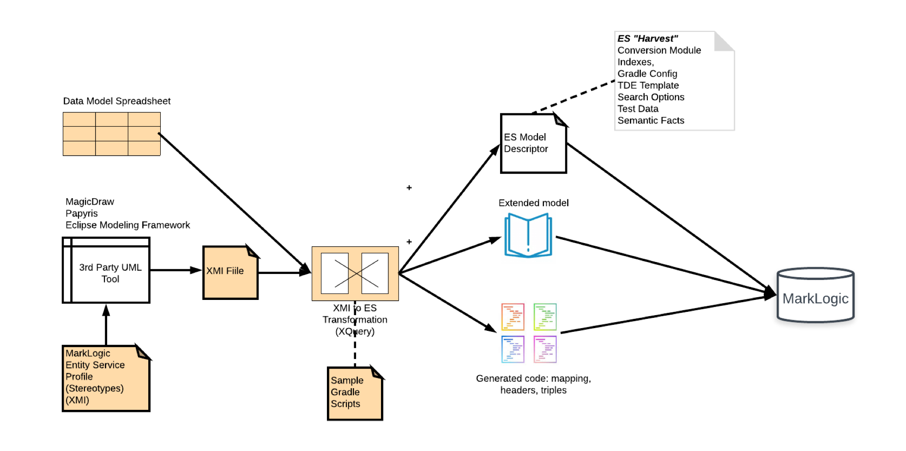

# UML to Entity Services Toolkit

## Intro

This is a toolkit to support modeling MarkLogic data in UML and mapping that UML model to Entity Services. For background, refer to the following blog posts:

- <http://www.marklogic.com/blog/how-to-model-manage-entities-uml/>
- <http://developer.marklogic.com/blog/uml-modeling-marklogic-entity-services>
- <http://developer.marklogic.com/blog/uml-modeling-marklogic-entity-services-semantics>

It works like this:

You use a third-party UML tool, along with a set of MarkLogic stereotypes, to build a data model. (If you don't have a UML tool or prefer spreadsheets, you can design your model in Excel instead!) The toolkit helps you use that model in MarkLogic. It does this by transforming your model to MarkLogic's Entity Services form; you can use gradle to include this transformation as part of your build. Once in Entity Services form, your model can be used to generate all sort of useful code to ensure that the data in MarkLogic conforms to your model. 

## What's In It?
The toolkit consists of the following parts:
- [uml2esTransform](uml2esTransform): MarkLogic server-side modules to map UML to Entity Services.
- [umlProfile](umlProfile): A UML profile containing stereotypes for MarkLogic Entity Services. Use this profile to include Entity Services configuration to your UML model.
- [excel](excel): You can build your model in Excel as an alternative to UML! The toolkit provides an [Excel template](excel/uml2es-excel-template.xlsx) for this purpose. See [examples/hrexcel](examples/hrexcel) for a detailed example of how to use it.
- [examples](examples): Numerous examples showing the use of UML (and Excel) data models for MarkLogic. Highlights: modeling for Entity Services and Template-Driven Extraction; modeling complex document relationships using UML relationships; the UML toolkit and Data Hub; the Data Hub "cookie cutter"; mixed models (documents + semantics); logical vs. physical; generating MarkLogic code from the UML model; using ml-gradle to run the transformation of UML to Entity Services as part of your build. 

## How We Expect You Will Use This Toolkit
As a user, you want to design a data model using UML and then ingest data into MarkLogic that conforms to this model. Put differently, you plan to put significant data into MarkLogic and want to ensure that the structure of this data follows a well considered model. 

If that's you, we think this toolkit is for you. You will need the following ingredients:

- A **third-party UML tool** that supports XMI 2.x export and UML profiles with tagged values. In the examples provided in this toolkit we use MagicDraw, Eclipse EMF, and Papyrus. Here are some useful tutorials showing the use of our toolkit with these tools: [Tool how-to's](tutorials/README.md).
- The **UML profile for MarkLogic**, provided in the [umlProfile](umlProfile) folder of this toolkit. You import this profile into your UML toolkit and then proceed to apply stereotypes from the profile to your classes and attributes. Using a stereotype, you can designate that a specific attribute should have a range index in MarkLogic, for example. A reference guide to these stereotypes is in the docs[docs/README.md](docs/README.md).
- A **transform module** to map your UML model to a form understood by MarkLogic: the Entity Services model. This module, written in XQuery, is in the [uml2esTransform](uml2esTransform) folder of this toolkit. There is a two-step process to using this module. First, you export your UML model to XMI (that's short for XMI Metadata Interchange); your UML tool needs to support that feature. Second, you pass in your XMI as input to the transform; it ouputs a JSON Entity Services model descriptor. Don't worry; the examples in this toolkit show how to call the transform and where it fits in your build-deploy-ingest workflow.
- A **build-deploy-ingest framework** to deploy your UML model to MarkLogic and ingest source data into MarkLogic in the form prescribed by the model. In other words, you need for your UML model to be more than a picture; you need MarkLogic code that shapes your data to fit the model. This toolkit provides several examples of a gradle-based approach. We recommend you one of these examples as your starting point, tailoring it for your needs.

## Where To Begin
Dive into the examples! The [movies example](examples/movies) is a good place to start. If you are planning to use MarkLogic's data hub framework, or if you are interested in semantics, begin with the [hr example](examples/hr). 

Here are a few tutorials on how to use the toolkit with MagicDraw and Papyrus: [Tool how-to's](tutorials/README.md). 

## Going Deeper
Once you get deeper into the toolkit, refer to the [docs](docs/README.md) to learn about: the profile and its stereotypes; how the transform maps UML to Entity Services; how the toolkit supports semantics; how to include the transform in your build process.

