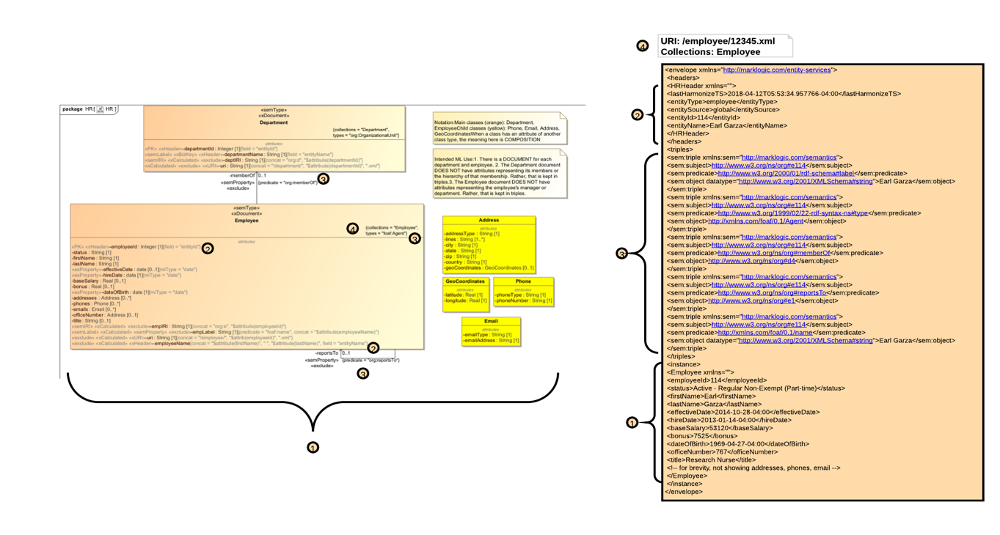

# The Envelope Please ... The Document Envelope and How It Arises From Your Model

Before we open the envelope, recognize two important points about the toolkit:

- The toolkit supports *mixed models*. A mixed model has both documents (i.e., data in XML or JSON form) and semantic triples. In MarkLogic, triples can be *embedded* within documents or reside on their own, outside of documents. A triple on its own it called a *managed* triple. A triple in a document is an *unmanaged*, or *embedded*, triple. The toolkit's focus in embedded triples.
- It is a common pattern in MarkLogic to structure your document as an *envelope*. An envelope is a JSON or XML document that contains three sections: *headers*, content (known as the *instance*), and embedded *triples*. 

The toolkit's code generation feature builds code that persists your business data to MarkLogic in an envelope form that conforms to your UML model. Specifically:

1. Its *instance* has a structure that matches your UML class/attribute structure. (For more see [uml_mapping.md](uml_mapping.md).) *Core* stereotypes also influence the structure; for example, *FK* affects document relationships, *esProperty* affects type.

2. Its *headers* contains specially designated header attributes from your model. The *xHeader* stereotype is used here.

3. Its *triples* section conforms to the *sem* stereotypes used in the model. 

4. The URI, collections, permissions, and metadata of the document conform to the *xDocument* stereotype. 

(If you're curious about the stereotypes mentioned above, read the profile reference [here](profile.md).)

The following diagram shows how this works:

