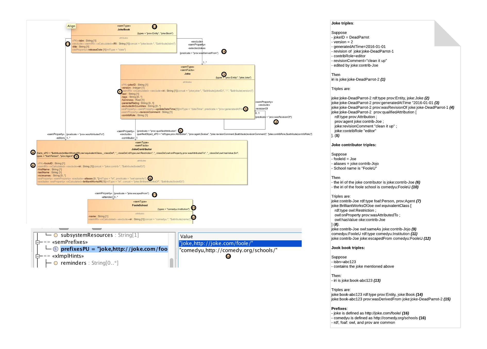

# Semantics and Mixed Modeling in the UML-to-Entity Services Toolit

And a link to here: <http://developer.marklogic.com/blog/uml-modeling-marklogic-entity-services-semantics> ... TODO...

## Mixed Model, Not Ontology Design
TODO - why we use the toolkit for mixed model; why that model is NOT an ontology ... 

## The Semantic Stereotypes
The stereotypes in our toolkit's UML profile for MarkLogic Entity Services are documented here: [profile.md](profile.md). In the profile there is a set of stereotypes to help you model the semantic part of your mixed model. Your model describes the structure of a *document* that is encased in an *envelope*. That envelope includes an important section called *triples*, where the semantic aspects of the document is contained. Semantics of a document include facts, expressed as triples, relating the document to other documents. 

You don't have to write the triples section of the envelope by hand. Using semantic stereotypes, your model can describe not only document structure but semantic meaning. The model can state that the document can be identified semantically with an IRI, that the document belongs to specific semantic classes, and the the document's relationships can be described using semantic properties. 

Here is a breakdown of the stereotypes:
- semType: The document belongs to (i.e., has as its RDF type) the specified semantic classes. [Something to ponder: The stereotype is tied to the UML class; a document whose structure is based on the UML class also has triples that tie it to semantic classes. This doesn't imply that the UML class has any connection to the semantic classes. It doesn't imply that the UML class is meant to define a semantic class.]
- semIRI: One of the attributes in the UML class contains the IRI of the document instance. 
- semLabel: One of the attributes in the UML class contains the RDFS English label of the document instance.
- semPredicate: A specific attribute in the UML class expresses a semantic property. That property's subject is the IRI of the document instance; put simply, the property is *about* the document instance containing this attribute. The object of the property is the attribute's value. That value might be a literal, but in the interesting case it is another document, whose UML class also has an IRI! The property's predicate is specified as a tag to the semPredicate stereotype. semPredicate also has a more complicated form in which you define the predicate using Turtle code.
- semFacts: Raw Turtle code that you can use to specify any semantic facts you like about the document instance.
- semPrefixes: Prefixes for the IRIs you refer to in the above stereotypes. You don't need to specify prefixes for the common semantics sets like owl and rdf.

Let's look at two examples. First take DHFEmployeeSample. It has: semPrefixes, semTypes, semIRI, semLabel, semProperty

### DHF Employee Sample
Here is the DHFEmployeeSample model and how triples are generated from it. To see a working sample, refer to [../examples/hr](../examples/hr).

### Joke Book
Here is the JokeBook model and how triples are generated from it. 

. To see a working example, refer to [../examples/jokeBook](../examples/jokeBook).

## Dynamic Names and Script
TODO - how this works...	

