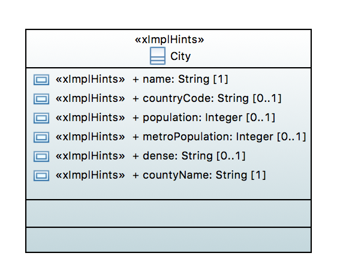

# A City Data Model With "Declarative Mapper" Source Mapping

## Intro
This example shows the interop of two tools: our UML-to-Entity Services toolkit; and the Declarative Mapper (TBD - link). The Declarative Mapper tool allows you to map data from source to target models using a configurable template. You can map source to target without writing code. At runtime, you apply the template to each source document; the Declarative Mapper outputs the desired target document, whose structure and content is determined by the template.

Using Declarative Mapper as a standlone tool, you write the template by hand. In this example, we let the UML model help generate the Declarative Mapper template. Let's see how this works. In the example, we model a city. Here is the model:

As with our other examples, the city model uses the ML profile to embellish the UML structure with ML-specific configuration. Specifically we use the xImpl stereotype to specify for each attribute of our City class, how that attribute is mapped from source data. The City class shown is the desired target structure. We have two sources from which we build this target structure: dmdemo and funbase. More on those in a moment. We don't bother modeling the sources, though in the xImpl stereotype we indicate, using the Declarative Mapper's path expression language, where in the source to find the attribute's value.

Here is how we map the population:

http://marklogic.com/xmi2es/xes/mapper/dmdemo,[[extract('population') * 1000 ]].

TODO explain this...

Here is how we map the country name:

http://marklogic.com/xmi2es/xes/mapper/dmdemo,"[[lookup('/countries.json', @country, coalesce(@language, 'en'))]]"
http://marklogic.com/xmi2es/xes/mapper/funbase,[[extract('country']]

TODO explain this... 

A few design points to mention:
- For many data models, we avoid source mapping altogether. The model shows the target we wish to build. There might be many sources from which the target obtains its data. The source structure is possibly very messy. The logic to transform source to target might be better expressed using a transform language than as stereotypes in the model. Even when the mapping is straightforward, we might consider the data model the wrong place to indicate source mapping logic. 
- We use the generic xImpl stereotype to specify source mapping. This stereotype can be used to specify any sort of design advice. We might have created a specific stereotype for source mapping. We haven't gone down that path because source mapping isn't often included in the data model artifact. See previous point.
- xImpl allows us to specify design advice as semantic triples. These triples are added to the extended Entity Services model. In the section "Explore the Mapping" you will see how we generate Declarative Mapper templates from these triples. Notice that we provide only the predicate and object. The predicate indicates which mapping to use -- in our example it's either dmdemo or funbase. The object is the Declarative Mapper expression. (As for the subject, it is the Entity Services IRI for the attribute.) In effect the triple says: for this attribute, from the source of type dmdemo (or funbase), use the following Declarative Mapper expression to obtain the value of the attribute.

## How to run:

Our project uses gradle. Before running, view the settings in gradle.properties. Create a file called gradle-local.properties and in this file override any of the properties from gradle.properties.

Here are the steps to setup.

### Setup DB
Setup new DB. Will use basic DB config with no indexes. Will bring in XMI2ES transform to our modules.

Run the following:

gradle -PenvironmentName=local -i includeXMI2ESTransform mlDeploy

Confirm:
- New DB and app server created with name xmi2es-examples-dmcity.

### Import the Model

Run the following to load the model:

gradle -PenvironmentName=local -i loadXMI

Confirm:
- Content DB has the following documents
	* /xmi2es/es/DeclarativeCity.json - Entity Services model descriptor.
	* /xmi2es/extension/DeclarativeCity.ttl - Entity Services extended model
	* /xmi2es/extension/DeclarativeCity.txt - Entity Services extended model described textually
	* /xmi2es/findings/DeclarativeServices.xml - Findings while converting to Entity Services. Should be no problems.
	* /xmi2es/gen/DeclarativeCity.txt - Generated code for DHF. Not used in this example.
	* /xmi2es/intermediate/DeclarativeCity.xml - XMI/ES intermediate form
	* /xmi2es/xmi/DeclarativeCity.xml - UML model in XMI form.

### Load the Source Data

Load the source data into our content database:

gradle -PenvironmentName=local -i loadSources

Confirm:
- Content DB now has, in addition to the documents created in the previous step, the following documents

	* /population.json - A large JSON containing the source city data for the dmdemo data set
	* /countries.json - A JSON lookup file that maps country code to country name. Used during our Declarative Mapper transformation.
	* /Otter Lake.json - A city record from the funbase data set.
	* /US Flag.json - A city record from the funbase data set.
	* /Venustown.json - A city record from the funbase data set.

### Deploy Declarative Mapper

Obtain the Declarative Mapper tool and deploy to the modules database from this example (xmi2es-examples-dmcity-modules). 

## Explore the Mapping
In Query Console, import XMI2ESDeclarative.xml workspace. You won't want to miss this part; it's where the fun happens. In this workspace you will: 
- Examine the source data and the entity services model.
- Generate the Declarative Mapper templates
- Pass the source data through the Declarative Mapper templates to obtain target data that conforms to the Entity Services model.
