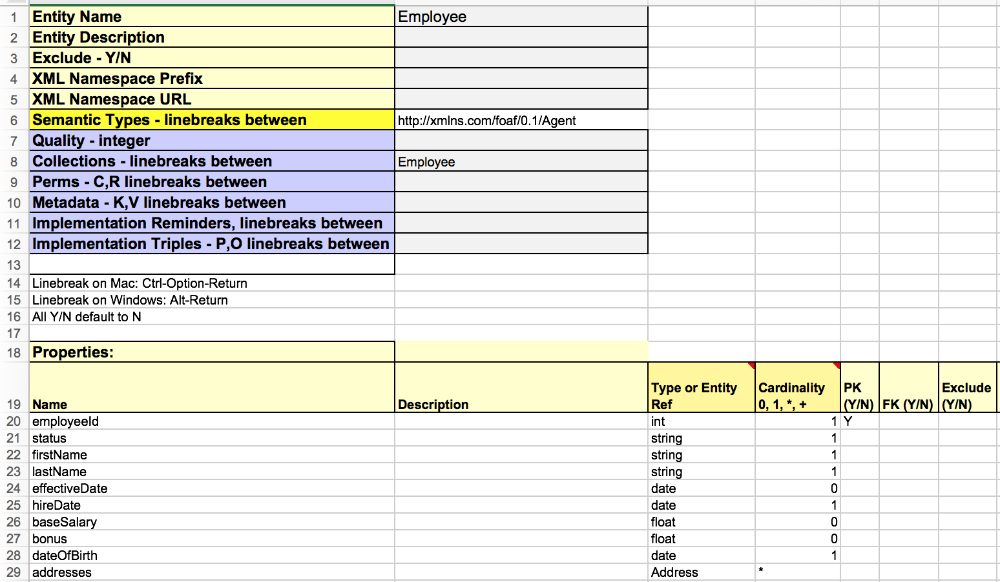

# Human Resources Data Model from Excel (No UML!!)

## Intro
In this example, we build a data model using an Excel spreadsheet. No UML! ... Well, not much UML anyway. You'll know why presently.

Our toolkit has the generic capability to generate an Entity Services model from an Excel document that follows the template, which you can find here: (../../excel/uml2es-excel-template.xlsx). In this example, we use that template to build a human resources data model of employees, departments, and their relationships. Our example shows how to transform the Excel model into Entity Services by running a gradle task. 

Our spreadsheet is HRExcel.xlsx. Here is a snapshot of it 

 

If you've gone through the other examples in this toolkit, you will notice the similiarity of the model in this spreadsheet to the UML model in examples/hr. Here is what that UML model looks like:

Our goal in this example is to model in Excel EXACTLY THE SAME HR model as in our HR UML example. To judge whether we have succeeded, we'll compare the output of the Excel- and UML-based HR models when passed through our toolkit's Entity Services transform. If they result in the same Entity Services model, we have succeeded.

That transform accepts two types of input: a UML model in XMI (XML Metadata Interchange) form; or an Excel spreadsheet based on our Excel model template. The transform outputs three artifacts: an Entity Services model descriptor (JSON), an extended model as a set of semantic triples (in TTL, or turtle, form), and generated code. To check model equivalence, we'll compare that the JSON descriptor and the TTL extended model are equivalent. (We don't need to compare the generated code, as its content is determined by the extended model anyway.)

Coming back to our boast of "No UML," that proves not to be wholly true. Under the covers, the transform converts Excel to UML form as the first step in its process to produce an Entity Services model from the Excel. Its second step is to convert that UML to Entity Services; the second step is exactly the logic the transform uses when converting an original UML model to Entity Services. 

Simply put, the two processes are:

Excel -> UML (as XMI) -> ES

UML (as XMI) -> ES

## How to run:

Our project uses gradle. Before running, view the settings in gradle.properties. Create a file called gradle-local.properties and in this file override any of the properties from gradle.properties.

Here are the steps to setup.

### Setup DB
Setup new DB. Will use basic DB config with no indexes. Will bring in XMI2ES transform to our modules.

Run the following:

gradle -PenvironmentName=local -i includeXMI2ESTransform mlDeploy

Confirm:
- New DB and app server created with name xmi2es-examples-hrexcel.

### Transform HR Excel to ES

Run the following to load the Excel HR model:

gradle -PenvironmentName=local -i loadExcel

Confirm:
- Content DB includes several documents created when loading the Excel, including:
	* /xmi2es/es/HRExcel.json - the ES model from the Excel
	* /xmi2es/extension/HRExcel.ttl - the extended ES model from the Excel
	* /xmi2es/findings/HRExcel.xml - findings during the transform of the Excel
	* /xmi2es/excel/HRExcel.xlsx - Original Excel file
	* /xmi2es/xmi/HRExcel.xml - Excel model converted to XMI form.

Check the /xmi2es/findings/HRExcel.xml file. This indicates whether there were any issues during the transform. Verify there are none.

### Transform HR UML to ES

For comparison, we will load the HR UML model from examples/hr. Run the following:

gradle -PenvironmentName=local -i loadUML

Confirm:
- Content DB now has, in addition to the documents created in the previous step, the following documents
	* /xmi2es/es/DHFEmployeeSample.json	 - the ES model from the UML
	* /xmi2es/extension/DHFEmployeeSample.ttl - the extended ES model from the UML
	* /xmi2es/findings/DHFEmployeeSample.xml - findings during the transform of the UML.
	* /xmi2es/xmi/DHFEmployeeSample.xml - the original UML model in XMI form.

Check the /xmi2es/findings/DHFEmployeeSample.xml file. This indicates whether there were any issues during the transform. Verify there are none.

## Check Model Differences
In Query Console, import XMI2ESExcel.xml workspace. In the tab entitled Check Diff, run to confirm the Excel- and UML-based models are the same.

