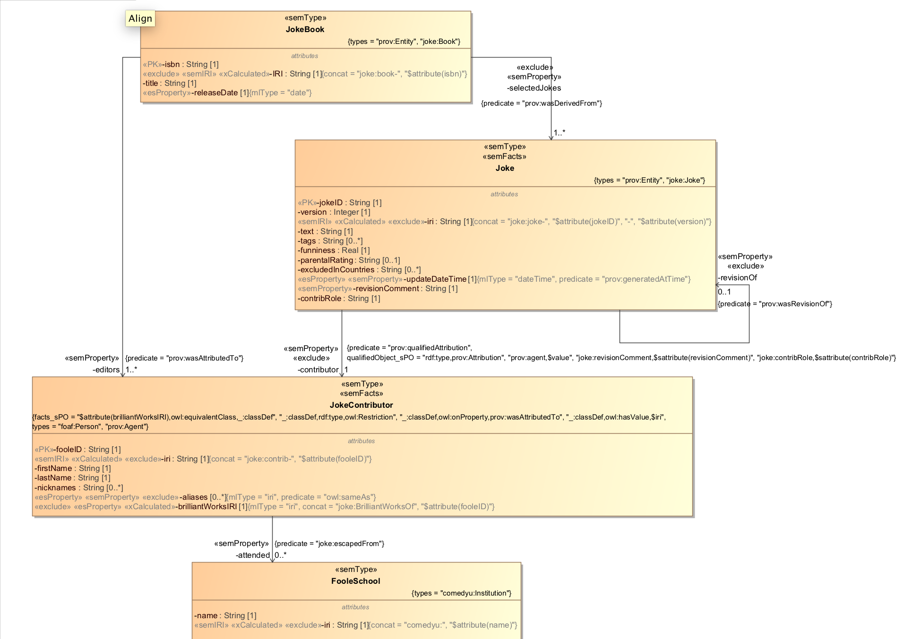

# JokeBook - Advanced Semantics

## Intro
This example exercises all the semantic stereotypes of the toolkit's profile. It shows how to tie a UML class to a semantic class, how to relate UML classes using semantic properties, how to qualify a semantic property with additional semantic facts, and how add associate arbitrary semantic facts with a UML class.

Here is our UML model. 

The toolkit's documentation shows how JokeBook's model maps to triples: [../../docs/semantics.md](../../docs/semantics.md).

Read about the semantic stereotypes here: [../../docs/profile.md](../../docs/profile.md).

## How to run:

Our project uses gradle. Before running, view the settings in gradle.properties. Create a file called gradle-local.properties and in this file override any of the properties from gradle.properties.

Here are the steps to setup.

### Setup DB
Setup new DB. Will use basic DB config with no indexes. Will bring in XMI2ES transform to our modules.

Run the following:

gradle -PenvironmentName=local -i clearGenerated includeXMI2ESTransform mlDeploy

Confirm:
- New DB and app server created with name xmi2es-examples-jokebook.
- Content DB is empty
- Modules DB includes these modules
  * /xmi2es/xmi2esTransform.xqy - Main module of the toolkit's transform

### Transform UML to ES
Next, move our UML model into ML as an ES model. Let's divide this into two parts.

#### Load UML Model and Observe Output of Transform

We will load our UML model and transform it to Entity Services format. Run the following:

gradle -PenvironmentName=local -i ingestModel

Confirm:
- Content DB has the following documents
	* /xmi2es/es/JokeBook.json (The ES model descriptor in JSON form)
	* /xmi2es/extension/JokeBook.ttl (Semantic triples that extend our model)
	* /xmi2es/findings/JokeBook.xml (Problems found during transformation)
	* /xmi2es/xmi/JokeBook.xml (The original UML model as an XMI document)
	* /xmi2es/gen/JokeBook/lib.sjs - generated Javascript code to create the triples
	* /xmi2es/gen/JokeBook/lib.xqy - generated XQuery code to create the triples
- Your gradle directory structure under data/entity-services-dump has the same documents as above.
- File JokeBook.json exists in gradle's data/entity-services directory. This is our ES model descriptor to be deployed.
- File JokeBook.ttl exists in gradle's data/entity-services-extension directory. This is our ES model extension to be deployed.
- File lib.sjs exists in gradle's data/entity-services-dump/gen/JokeBook directory. The transform generated this server-side Javascript code module to populate triples based on the model. You will use this in the Explore section below.
- File lib.xqy exists in gradle's data/entity-services-dump/gen/JokeBook directory. The transform generated this XQuery server-side code module to populate triples based on the model. You will use this in the Explore section below.

Check the /xmi2es/findings/JokeBook.xml file. This indicates whether there were any issues during the transform. Verify there are none.

#### Deploy Entity Services Model and Associated Artifacts

Next, generate ES artifacts. Run the following:

gradle -PenvironmentName=local -i mlgen loadExtendedModel mlReloadModules

Confirm:
- Modules DB now has /JokeBook/lib.sjs and /JokeBook/lib.xqy
- Content DB now has the following document
  * /marklogic.com/entity-services/models/JokeBook.json

- In Query Console, open a tab of type SPARQL, point to the content DB, run the following query, and verify you get any results. This means the ES model is in FINAL and its semantic metadata is populated.

select * where {?s ?o ?p}

Among the results, you should see the following:
- <http://com.marklogic.es.uml.joke/JokeBook-0.0.1/JokeBook/selectedJokes>	<http://marklogic.com/entity-services#title>	"selectedJokes" - From basic ES model
- <http://com.marklogic.es.uml.joke/JokeBook-0.0.1/JokeBook/selectedJokes>	<http://marklogic.com/xmi2es/xes#semPredicate>	<http://www.w3.org/ns/prov#wasDerivedFrom> - From the extended ES model

## Explore
In Query Console, import XMI2ESJokeBook.xml workspace. You won't want to miss this part; it's where the fun happens: you create documents whose embedded triples conform to the model! 
