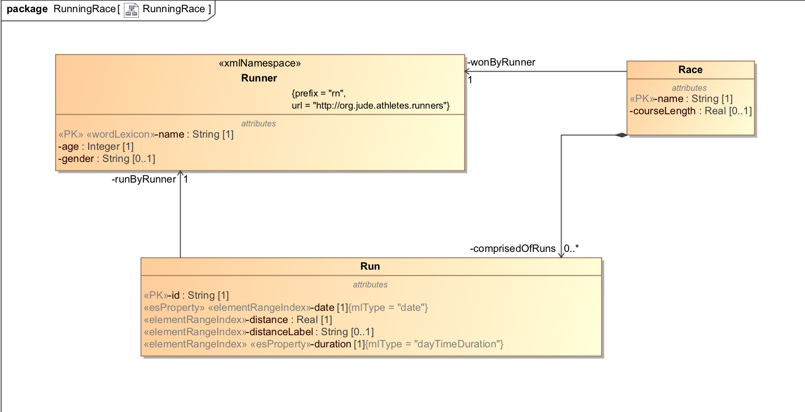
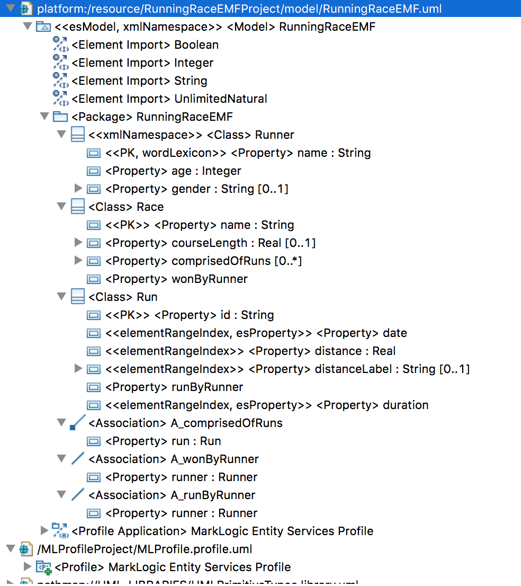
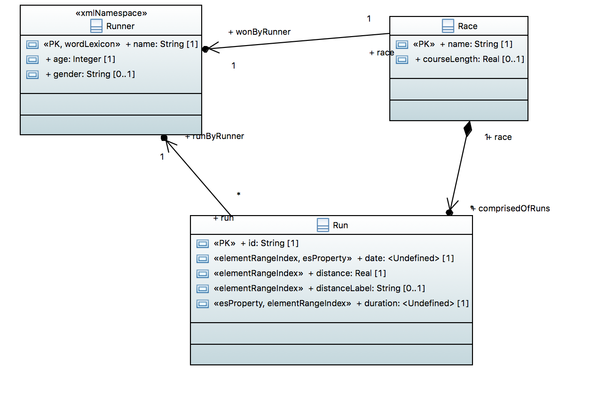

# Running Race Example

## Intro
This sample demonstrates interop. We model a running race in three UML editors: MagicDraw, Eclipse Modeling Framework (EMF), and Papyrus. We show that all UML models transform to the same ES model descriptor. Our model is based on one of the examples from MarkLogic's Entity Services github: <https://github.com/marklogic/entity-services/tree/master/entity-services-examples/example-races/>. 

## Models
Here is the MagicDraw model:

Here is the EMF model:

Here is the Papyrus model:

## How to run:

Our project uses gradle. Before running, view the settings in gradle.properties. Create a file called gradle-local.properties and in this file override any of the properties from gradle.properties.

Here are the steps to setup.

### Setup DB
Setup new DB. Will use basic DB config with no indexes. Will bring in XMI2ES transform to our modules.

Run the following:

gradle -PenvironmentName=local -i includeXMI2ESTransform mlDeploy

Confirm:
- New DB and app server created with name xmi2es-examples-runningRace.

### Transform UML to ES

Run the following:

gradle -PenvironmentName=local -i loadXMI

Confirm:
- Content DB has the following documents
	* /xmi2es/es/RunningRace.json
	* /xmi2es/es/RunningRaceEMF.json
	* /xmi2es/es/RunningRacePapyrus.json
	* /xmi2es/extension/RunningRace.ttl
	* /xmi2es/extension/RunningRace.txt
	* /xmi2es/extension/RunningRaceEMF.ttl
	* /xmi2es/extension/RunningRaceEMF.txt
	* /xmi2es/extension/RunningRacePapyrus.ttl
	* /xmi2es/extension/RunningRacePapyrus.txt
	* /xmi2es/findings/RunningRace.xml
	* /xmi2es/findings/RunningRaceEMF.xml
	* /xmi2es/findings/RunningRacePapyrus.xml
	* /xmi2es/xmi/RunningRace.xml
	* /xmi2es/xmi/RunningRaceEMF.xml
	* /xmi2es/xmi/RunningRacePapyrus.xml

## Check Model Differences
In Query Console, import XMI2ESRunningRace.xml workspace. In the tab entitled Check Diff, run to confirm the models are the same.

