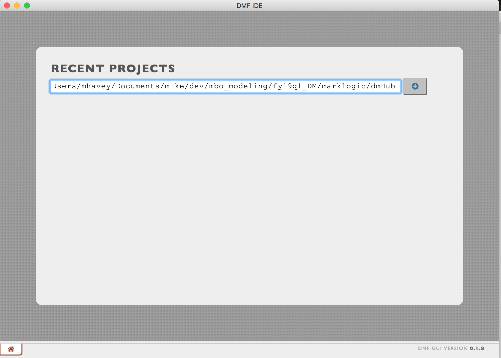
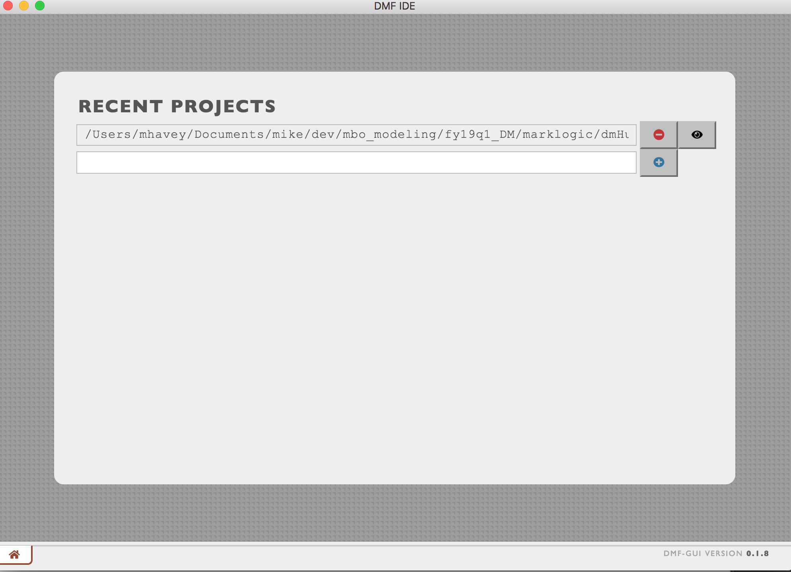
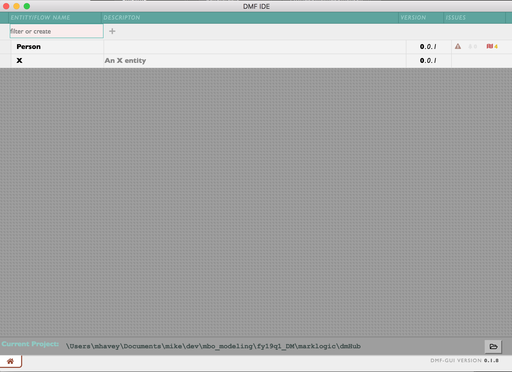
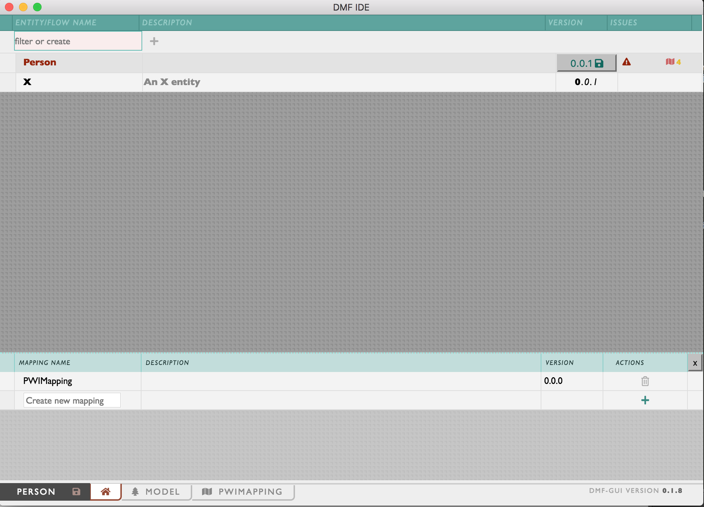
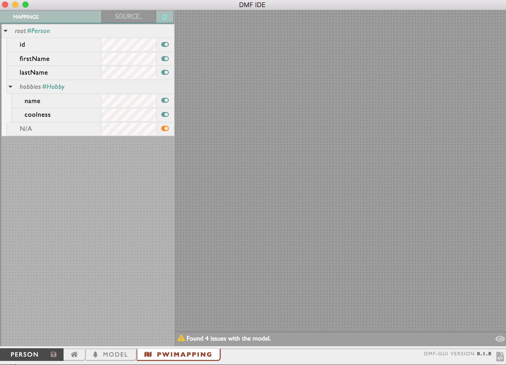
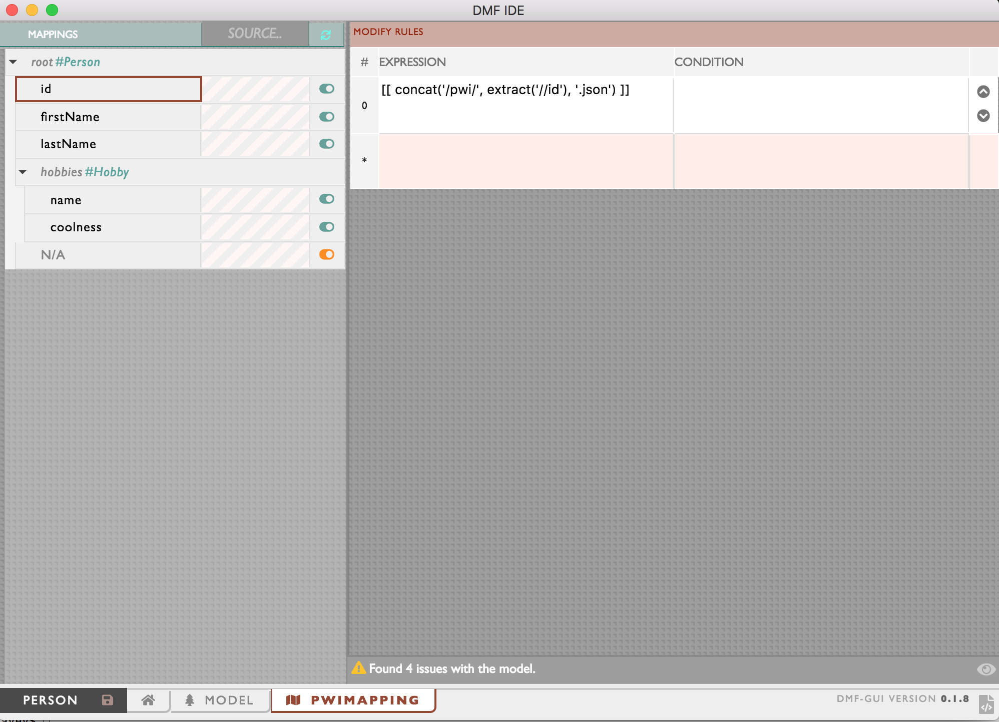
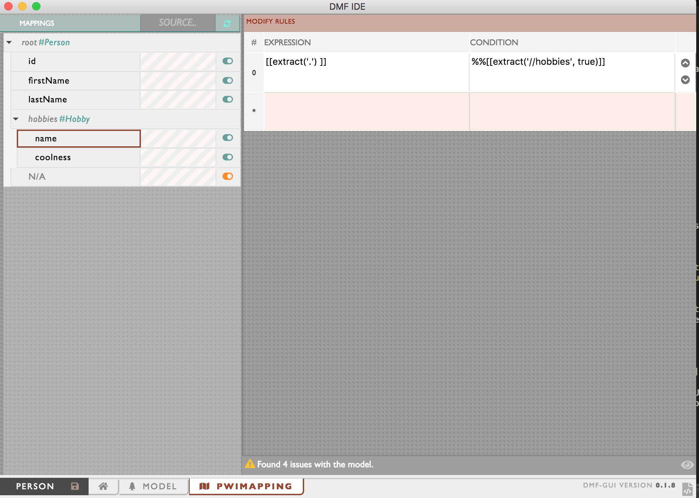
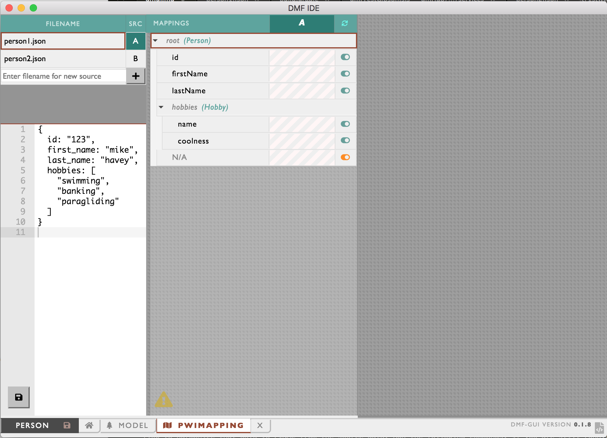
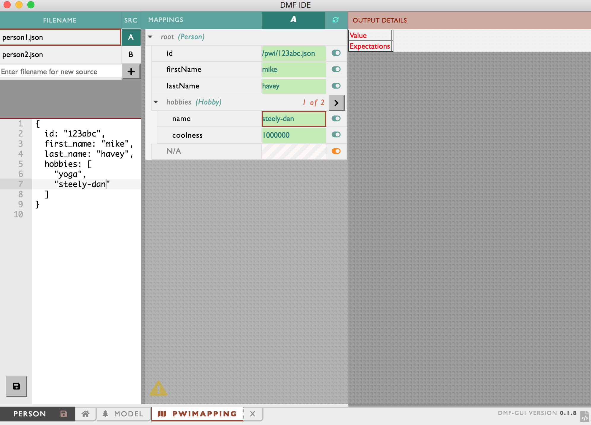

# Zero Code Model-Map-Harmonize (MarkLogic Internal and UNDER CONSTRUCTION)

## Intro
This tutorial shows how you, *without having to write any code*, can move raw, messy data into MarkLogic and convert it to a much better form that conforms to a UML model. Our approach can best be described as *model-driven declarative mapping*. There's no coding; developers aren't needed. Rather, the brunt of the work is done by the two roles you would expect: 

- A data architect, who creates the data model in a third-party UML tool (in our case, Papyrus).
- A source-data subject-matter expert (SME), who uses the Declarative Mapper IDE tool to define the source-to-target mapping. This SME is an expert in the messy source data and works closely with the data architect to understand the UML-defined target data format.

The data architect and source-data SME are helped by a build person, who creates a gradle-based MarkLogic data hub environment that incorporates the UML and mapping tools. 

The diagram below outlines the steps of the zero-code effort. 


A) The data architect in Papyrus creates the UML data model. 

B) The data architect, using the build environment created by the build person, uses UML2ES to convert the UML model to MarkLogic's Entity Services (ES) form. 

C) The source-data SME works within the Declarative Mapper IDE tool to map source data to the model form (UML, ES) of the data. 

D) The source-data SME works with the build person to incorporate the source data SME's declarative mapping into a data hub harmonization process. When this harmonization process is run, the raw source data is converted to the model's form using the declarative mapping.

There's no coding in this process... not even in step D! All the work is done by data experts and tools! To see why, try out this tutorial! You will play each of the roles through all the above steps. 

For this tutorial you need MarkLogic (version 9 or later), UML2ES, Papyrus (an open-source UML tool), the Declarative Mapper IDE (a MarkLogic field tool), and the Declarative Mapper engine (another MarkLogic field tool). [The two Declarative Mapper tools are available on MarkLogic's internal BitBucket repository. This tutorial is MarkLogic internal.]

- You will need a local clone of UML2ES
- See [How to install Papyrus](papyrus_install.md) for instructions on installing Papyrus
- See [How to install Declarative Mapper](dm_install.md) for instructions on installing the Declarative Mapper UI and engine

## Why is this Tutorial Under Construction

Model-based mapping is soon to be a built-in feature of MarkLogic. In this tutorial we use a separate field tool, the Declarative Mapper.  This tutorial will soon be revised to use the built-in MarkLogic mapper. 

The DM IDE tool is ever-changing. In this tutorial we use it as a visual editor for the Declarative Mapper field tool. Currently it is intended to fit multiple mapping engines: not just Declarative Mapper, but also Schematron. But DM IDE could grow into a UI editor for MarkLogic's built-in mapper. When that happens, this tutorial will show how the source data SME uses DM IDE to create a mapping for the MarkLogic mapper! 

## Step 1: Standup a MarkLogic Environment and Build Process (Build Person)

<details><summary>Click to view/hide this section</summary>
<p>

We get started by having you, in the role of build person, setup a data hub, with UML2ES and the Declarative Mapper, on MarkLogic.

Pre-requisites:
- MarkLogic 9 (or greater) installation up and running
- Local clone of UML2ES
- Local clone of Declarative Mapper engine. See [How to install Declarative Mapper](dm_install.md)
- Declarative Mapper IDE up and running. First obtain a local clone. Then setup and run. See [How to install Declarative Mapper](dm_install.md)

To begin, create a folder called dmHub anywhere on your build machine. This folder will be a data hub gradle project that incorporates the UML2ES and the DM toolkits. 

Copy into the dmHub folder the entire contents (preserving directory structure) of [dmHubLab/step1](dmHubLab/step1). You did the copy correctly if you see build.gradle and data/coolness/hobbyCoolness.json directly under dmHub. Otherwise, remove what you copied and try again at the correct level. 

What you just copied is the gradle build file, the gradle properties file, the log4j properties file, the source person data, and some miscellaneous artifacts. Tweak the gradle.properties once you've copied it over. For example, modify mlHost if you're ML server is not running on localhost; modify mlUsername and mlPassword if your admin username/password is not admin/admin.

Copy into dmHub/src/main/ml-modules/root the UML2ES transform code [../uml2esTransform/src/main/ml-modules/root/xmi2es](../uml2esTransform/src/main/ml-modules/root/xmi2es). You did it right if you can see the file dmHub/src/main/ml-modules/root/xml2es/xml2esTransform.xqy. If you don't see the file in exactly that this location, remove what you copied and try again at the correct level. 

Copy into dmHub/src/main/ml-modules/ext the Declarative Mapper engine code. Copy from your local DM engine clone the directory declarative-mapper/src/main/ml-modules/root/ext to dmHub/src/main/ml-modules/root/ext. You did it right if you can see dmHub/src/main/ml-modules/root/ext/declarative-mapper.sjs and dmHub/src/main/ml-modules/root/ext/declarative-mapper/runtime.sjs. If you don't see the files in exactly that this location, remove what you copied and try again at the correct level. 

Copy into the main folder dmHub the UML2ES build file [../uml2esTransform/uml2es4dhf.gradle](../uml2esTransform/uml2es4dhf.gradle).

Under dmHub/data, create subfolders model and papyrus

Copy into dmHub/data/papyrus the UML2ES profile [../umlProfile/eclipse/MLProfileProject](../umlProfile/eclipse/MLProfileProject). You did it right if you can see the file dmHub/data/papyrus/MLProfileProject/MLProfile.profile.uml. If you don't see the file in exactly that location, remove what you copied and try again at the correct level. 

When you are done, you should have the following folder structure: ... TODO - update; add service folder, remove hack


Now let's initialize the hub. In a command prompt navigate to your employeeHub folder and run the following:

gradle -i hubInit

This creates a few additional subfolders: plugins, src/main/hub-internal-config, src/main/ml-config, src/main/ml-schemas, build, gradle, and .gradle. 

Finally, let's create an instance of the data hub. In the command prompt, run the following

gradle -i mlDeploy

When this has completed, you should see in your MarkLogic environment several new databases, including xmi2es-tutorials-dmHub-STAGING, xmi2es-tutorials-dmHub-FINAL, and xmi2es-tutorials-dmHub-MODULES. Check in admin console you have these.

</p>
</details>

## Step 2: Design UML Model - PersonWithInterest (Data Architect)

<details><summary>Click to view/hide this section</summary>
<p>

Next you get to play the role of data architect. You will use the UML modeling tool Papyrus to design a *person with interests* (PWI) data model. The purpose of the model is to define the structure of persons and their hobbies/interests. The model is straightforward; the mapping, as we will see in step 4, has interesting nuances.

### Step 2a: Setup Workspace and Projects

Pre-requisite: You need Papyrus. If you don't have Papyrus, install it. See [How to install Papyrus](papyrus_install.md) for instructions.

Open Papyrus in a new workspace. The location of the workspace on your local machine is unimportant. 

To use your new model with MarkLogic, you need to add the UML-to-Entity Service profile. In Step 1 you copied it from the UML2ES clone to dmHub/data/papyrus/MLProfileProject. To import into Papyrus, from the File menu select Import | General | Existing Projects Into Workspace. 


Click Next. In the Import Projects dialog, make sure "Select root directory" is selected. Use the Browse button to locate the ML profile in dmHub/data/papyrus/MLProfileProject. 


Click Finish. You should now see the profile project in the Project Explorer pane in the upper-right corner of Eclipse. Next, create a project for the PWI model. From the File menu choose New | Other. From the Select wizard, choose Papyrus project.


Click Next. In the Diagram Language window, select UML.


Click Next. In the next window enter the project name as PWIModel. Select the model file name as PWIModel. For the location, uncheck "Use default location". For location, browse to the dmHub/data/papyrus folder you created in Step 1. To this path append PWIModel.


Click Next.  In the next page, under Diagram Kind, select Class Diagram. Click the box "A UML model with basic primitive types." Under "Choose a profile to apply", select Browse Workspace and select MLProjectProfile|MLProfile.profile.uml. 


Click Finish. In Papyrus, you now see two projects in your workspace:


### Step 2b: Create Classes

We will design a relatively simple model consisting of two main classes: Person and Hobby. In the palette select Class and drag it onto the canvas. It creates a class called Class1.


In the bottom panel, select Properties. Change the name of the class to Person.


Create a second class by selecting Class in the palette and dragging it onto the canvas. It creates a class called Class1. In the bottom panel, select Properties and change its name to Hobby.


In the canvas, hover over the Person class. From the bar select Add Property Class Attribute Label.


It creates an attribute called Attribute1. Select the attribute and in the properties change the name to "id" and the type to String (under UML Primitives).


Create two more attributes in Person: firstName and lastName. Both are strings. In the Hobby class create two attributes: name and coolness. Name is a string; coolness is an integer (found under UML Primitives).


In the palette under Edges select Association. Drag it onto the canvas. Connect Person class to Hobby class. 


Select the association in the Properties. Change the leftmost Member End's name from "hobby" to "hobbies". Also change its mulitiplicity to 0..* and its Aggregation to shared.


### Step 2c: Stereotyping the Model

To help map this to Entity Services, we'll add a few stereotypes to our model.

First we will make the id attribute of Person a primary key. To do this, select the id attribute. In the Properties panel select Profile. Click the + button above Applied Stereotypes. From the list of applicable stereotypes select PK and click the arrow to move it to Applied Stereotypes.


Click OK. The class now looks like this.


Using a similar approach, add the elementRangeIndex stereotype to the two Hobby attributes; this allows us to build a facet of hobby names and to perform numeric range queries on coolness. 


We will give our model a version and a namespace. Click in a blank part of the canvas. Under Properties select Profile. Under Applied Stereotype click the +. (If you can't see Applied Stereotypes, make the properties panel larger.) Under Applicable Properties select esModel and click the arrow button to move it to Applied Properties.


Click OK. Back in the Properties panel, you see the esModel has been added. Expand it, click on version. In the right text box type 0.0.1.


Similarly for baseUri enter the value http://xyz.org/marklogicModels.

In the same Properties window select UML and change the name from Root Element to Person.


Physically in MarkLogic, instances of the Person class are documents. Let's designate the id attribute as the URI of the document. Configuring this is straightforward; follow the same step as when setting id as PK. You end up with the following:


We are done modelling. Click File | Save All.

If you think you might have messed up along the way, a pre-cooked model is available under [dmHubLab/step2/PWIModel](dmHubLab/step2/PWIModel). If you want it in your workspace, the simplest way is to copy each of its files over yours. You can also delete the PWIModel project from your workspace (by right-clicking the project and selecting Delete, but keeping the contents!) and import the pre-cooked project (File | Import | Existing Projects Into Workspace). 

</p>
</details>

## Step 3: Transform UML to ES Model (Data Architect, Build Person)

<details><summary>Click to view/hide this section</summary>
<p>

Next, as the data architect, with help from the build person, you will convert the UML model you created in Step 2 to a MarkLogic Entity Services model. Run the following from the command line in the gradle project folder that the build person created in Step 1.

gradle -i deployPWIModel

That command should run successfully; you should see "BUILD SUCCESSFUL" when its completes. The UML model has been convereted to ES and is setup as a data hub plugin. You can see the ES model in a few places. If you open Query Console and explore the xmi2es-tutorials-dmHub-FINAL database, its URI is /marklogic.com/entity-services/models/PWIModel.json. In your gradle project the same ES model is in plugins/entities/Person/Person.entity.json.

</p>
</details>

## Step 4: Defining the Mapping (Source Data SME)

<details><summary>Click to view/hide this section</summary>
<p>

In Step 4 you play the role of Source Data SME. Using the Declarative Mapper IDE, you map source data to the form of the UML PWI model created in Step 3. 

## Step 4a: Build the Mapping

First, open the DM IDE tool; see [How to install Declarative Mapper](dm_install.md) for instructions. In the initial screen ("Recent Projects"), paste in the fully path of your gradle project. Then click the + button.



In the next screen, in the bottom left corner, click the Folder button. 


This takes you back to Recent Projects. Click on the eye button.



The next screen shows you the entities in the project. Click on Person. 



Under mappings, create a new mapping called PWIMapping. In the "Mapping name" text box type PWIMapping. Under actions, click +. 



On the bottom select the PWIMAPPING tab. This brings up the PWI Mapping editor:



Time to map! First, understand the source data. Look at person1.json in the data/persons directory of your gradle project (also in [dmHubLab/step1/data/persons](dmHubLab/step1/data/persons)):

{
  id: "123",
  first_name: "mike",
  last_name: "havey",
  hobbies: [
    "swimming", 
    "banking",
    "paragliding"
  ]
}

Conceptually, the mapping to the model works as follows:
- id, first_name, last_name in the source are mapped to the id, firstName, and lastName attributes of the Person entity. Well, id is not mapped exactly as is. Rather, the Person.id attribute is the concatenation of "/pwi/", the id source value and ".json".  Person.id ends up looking like a URI.
- In the source object, hobbies is an array of strings (hobby names). In the model form, Person.hobbies is an array of Hobby objects, each consisting of a name and coolness. The source document has only the names. Coolness is determined by a lookup on the hobbyCoolness.json document in the data/coolness directory of your gradle project (also in [dmHubLab/step1/data/coolness](dmHubLab/step1/data/coolness)).

{
	"swimming": 1,
	"banking": 3,
	"steely-dan": 1000000, 
	"paragliding": 100000,
	"scotch": 100000,
	"yoga": 0
}


Now that you understand how the mapping should work, use the DM IDE tool to create the mapping for real. Use the grammar of the Data Hub Framework field tool. Under Person, select id. In the editor on the right, under Expression, type [[ concat('/pwi/', extract('//id'), '.json') ]]



In a similar way, map first_name to [[ extract('//first_name') ]] and last_name to [[ extract('//last_name') ]]

The hobby array requires special care. Click on the name attribute. Under expression enter [[extract('.') ]] Under condition enter %%[[extract('//hobbies', true)]] The condition is an array iterator; each hobby will iterate over the list of hobby names (//hobbies) in the source. The name expression is just the value of the name. 



For coolness, enter the expression: [[ lookup('/hobbyCoolness.json', extract('.')) ]] Coolness is the numeric value corresponding to the hobby name in hobbyCoolness.json. You don't need to enter a condition for coolness; it uses the same condition as name.

Click the save button (bottom left corner) to save your mapping. It gets saved to plugins/entities/Person/harmonize/PWIMapping/PWIMapping.mapping.json file in your gradle project. If you think you messed up, you can get the correct mapping file from [dmHubLab/step4/PWIMapping/PWIMapping.mapping.json](dmHubLab/step4/PWIMapping/PWIMapping.mapping.json); copy it into plugins/entities/Person/harmonize/PWIMapping/PWIMapping.mapping.json 

## Step 4b: Test the Mapping Within IDE

First, load the sample documents by running:

gradle -iloadDmIdeSampleData mlReloadModules

Run mlWatch to auto-detect and deploy changes to the sample documents:

gradle -i mlWatch

Restart the DM IDE and select PWIMapping. In the left panel, select person1.json. 



In the center panel, just above the mapping, click the Refresh button. Wait a few seconds. You will see the results of the mapping applied to the sample document as green-shaded text within the mapping.


Edit the source document in the left panel of the IDE. Make the id "123abc". Also change the hobbies to contain only "yoga" and "steely-dan". When done, click the save button.


Wait a minute. Then click the Refresh button again. You will see slightly different results in the green-shaded text. 



</p>
</details>

## Step 5: Ingest and Harmonize Data (Build Person)

<details><summary>Click to view/hide this section</summary>
<p>

As the build person you now ingest and harmonize the data using the model and the mapping. You don't write any code. It's all gradle from here on out. 

First let's create a DHF input flow to ingest our Person source data into STAGING. Also, let's create a DHF harmonization flow to harmonize that data to FINAL from the source data. Run the following commands; if you are still running mlWatch (from the previous step), cancel it (Ctrl-C):

gradle -i hubCreateInputFlow -PflowName=LoadPerson -PuseES=false

gradle -b uml2es4dhf.gradle -i uCreateDHFHarmonizeFlow -PflowName=harmonizePWI -PcontentMode=dm 

You just generated a bunch of code. The good news is, you won't need a developer to touch it. The Input Flow ingests the data as is. The harmonization produces data that conforms to the UML model using the mapping from Step 4. You do need to "deploy" that mapping:

gradle -i mlReloadModules deployPWIMapping

Next, ingest the source person data in the data/persons directory (as well as the hobbyCoolness lookup in data/lookup). We'll create a DHF input flow and run MLCP to ingest the person data through that flow. 

gradle -i loadPersonSourceData ingestLookup

If you look in the staging database (xmi2es-tutorials-dmHub-STAGING), you will see the ingested files /person1.json, /person2.json, and /hobbyCoolness.json.  


Last, but not least, run the harmonization:

gradle -i hubRunFlow -PflowName=harmonizePWI

If you now explore the FINAL database (xmi2es-tutorials-dmHub-FINAL), you will see two new documents in the Person collection. Their URIs are /pwi/123.json and /pwi/456.json. How did they end up with these URIs? - In the model we designated the id attribute as the "xURI". In the mapping, we defined id as the concatenation of "/pwi", the value of the id attibute from the source document, and ".json". 

Click on /pwi/123.json to see its contents. 

```
{
  "envelope": {
    "headers": {},
    "triples": [],
    "instance": {
      "Person": {
        "id": "/pwi/123.json",
        "firstName": "mike",
        "lastName": "havey",
        "hobbies": [
          {
            "Hobby": {
              "name": "swimming",
              "coolness": 1
            }
          },
          {
            "Hobby": {
              "name": "banking",
              "coolness": 3
            }
          },
          {
            "Hobby": {
              "name": "paragliding",
              "coolness": 100000
            }
          }
        ]
      }
    },
    "attachments": null
  }
}
```

</p>
</details>


