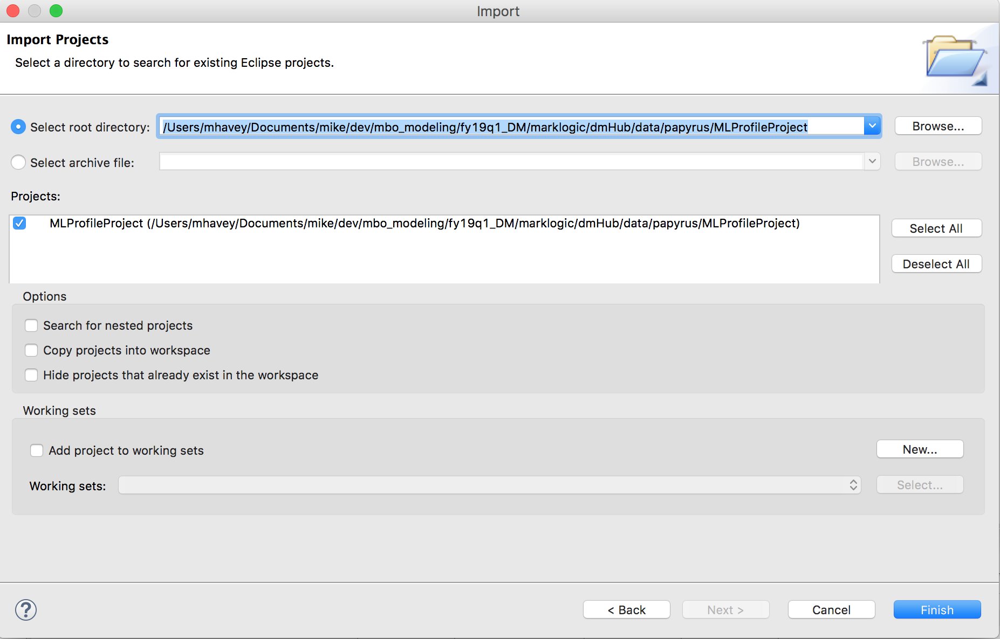
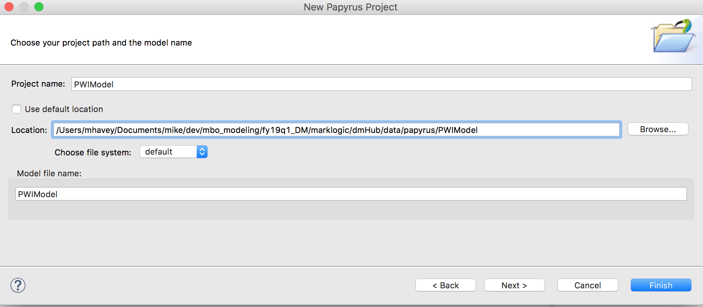
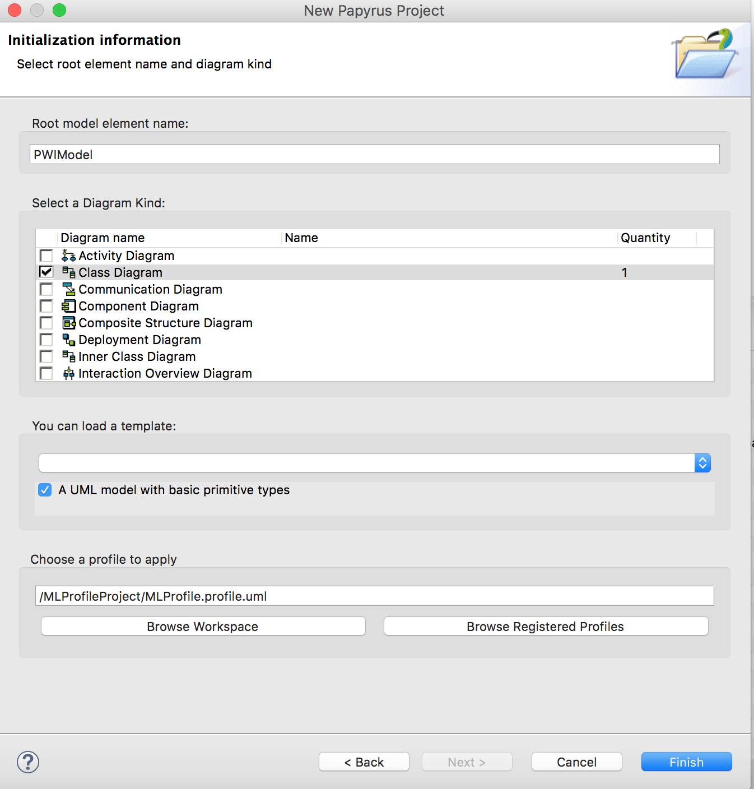
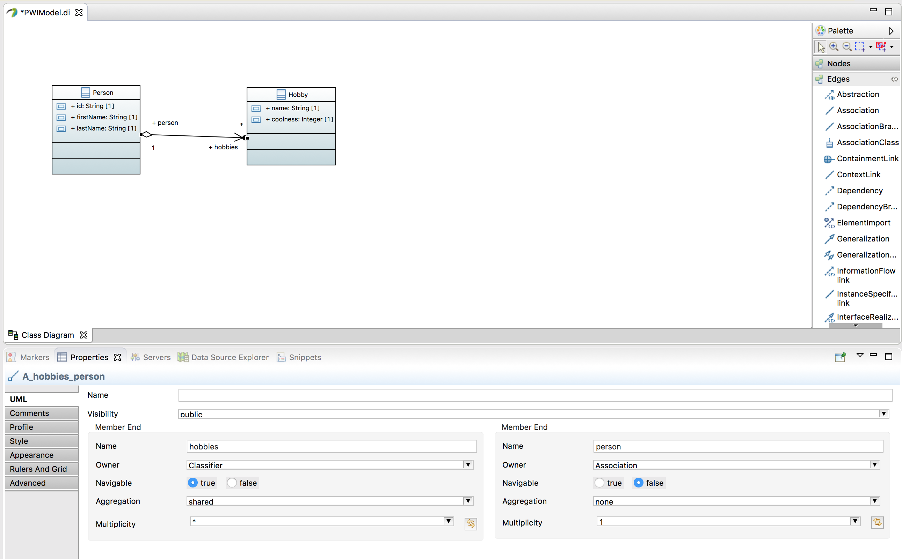
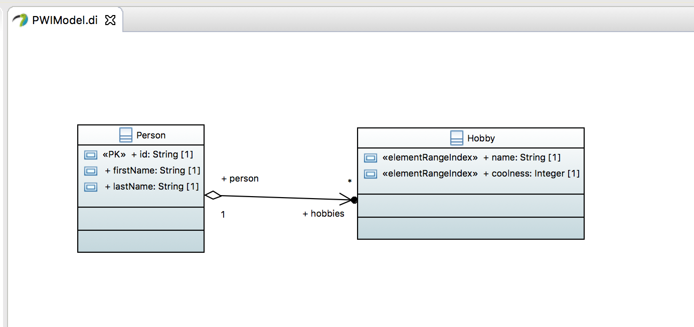
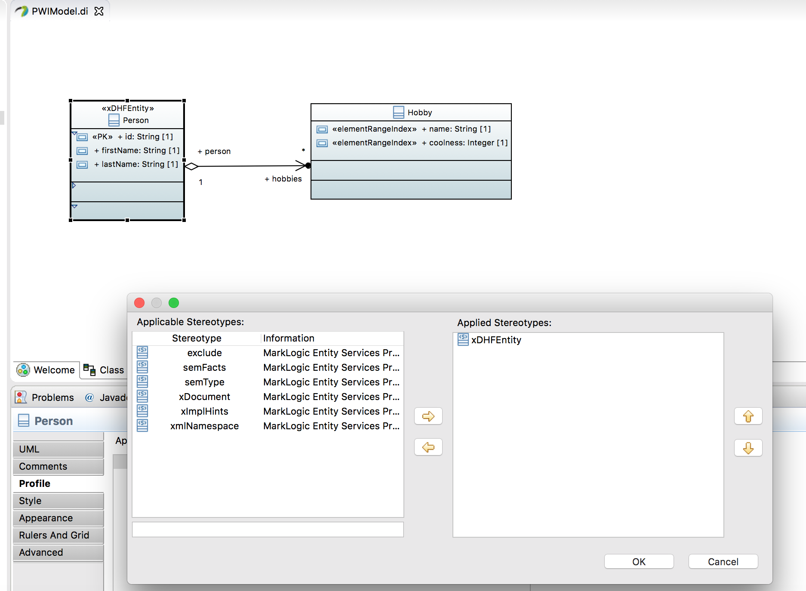
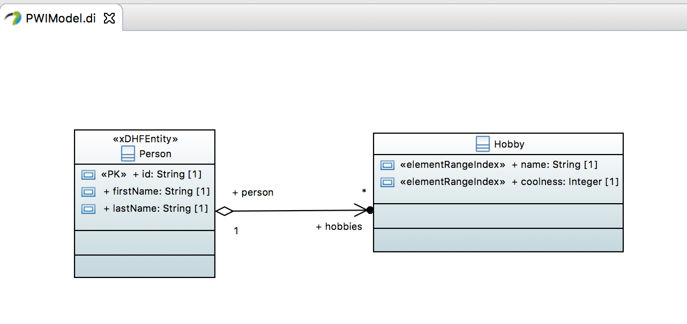
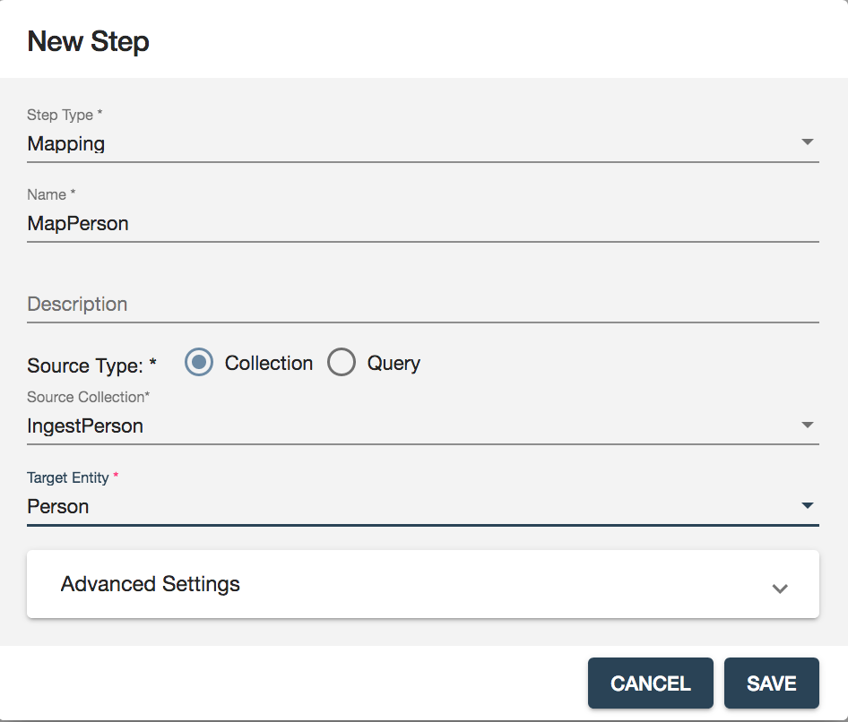
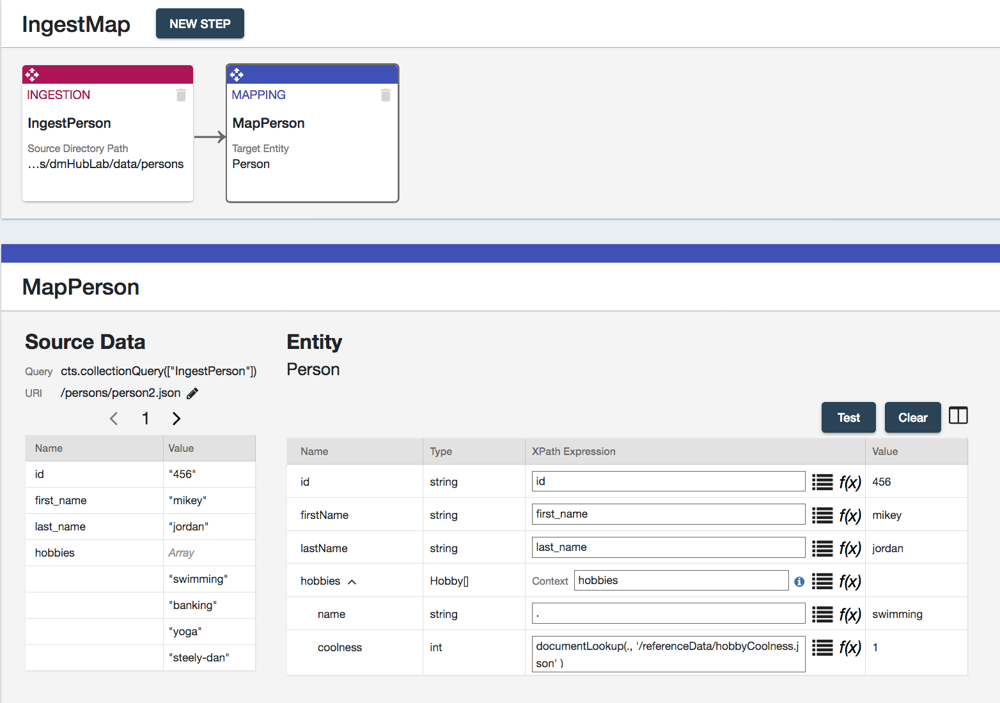
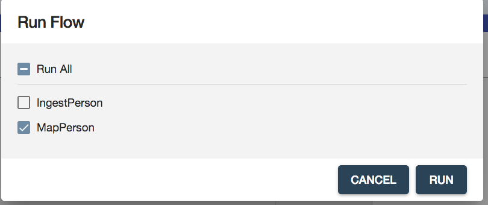

# Zero Code Model-Map-Harmonize (MarkLogic Internal and UNDER CONSTRUCTION)

## Intro
This tutorial shows how you, *without having to write any code*, can move raw, messy data into MarkLogic and convert it to a much better form that conforms to a UML model. Our approach can best be described as *model-driven declarative mapping*. There's no coding; developers aren't needed. Rather, the brunt of the work is done by the two roles you would expect: 

- A data architect, who creates the data model in a third-party UML tool (in our case, Papyrus).
- A source-data subject-matter expert (SME), who uses the Data Hub's mapper tool to define the source-to-target mapping. This SME is an expert in the messy source data and works closely with the data architect to understand the UML-defined target data format.

The data architect and source-data SME are helped by a build person, who creates a gradle-based MarkLogic data hub environment that incorporates the UML and mapping tools. 

The diagram below outlines the steps of the zero-code effort. 


A) The data architect in Papyrus creates the UML data model. 

B) The data architect, using the build environment created by the build person, uses UML2ES to convert the UML model to MarkLogic's Entity Services (ES) form. 

C) The source-data SME works within the Data Hub QuickStart tool to map source data to the model form (UML, ES) of the data. 

D) The data flow to stage raw source person data, map it to the model's form, and persist that model-based data to the hub's FINAL database, is executed. In the tutorial we'll run it manually within Quick Start. It is simple enough step for any of the roles to execute. In a production environment, its execution is likely scripted by the build person.

There's no coding in this process... not even in step D! All the work is done by data experts and tools! To see why, try out this tutorial! You will play each of the roles through all the above steps. 

For this tutorial you need MarkLogic (version 9 or later), UML2ES, Papyrus (an open-source UML tool), and the Data Hub 5.1 QuickStart tool.

- You will need a local clone of UML2ES
- See [How to install Papyrus](papyrus_install.md) for instructions on installing Papyrus

## Step 1: Standup a MarkLogic Data Hub (Build Person)

<details><summary>Click to view/hide this section</summary>
<p>

We get started by having you, in the role of build person, setup a data hub, with UML2ES, on MarkLogic.

Pre-requisites:
- MarkLogic 9 (or greater) installation up and running
- Local clone of UML2ES
- Data Hub Framework 5.1 QuickStart

## Step 1a: Create an environment in Quick Start

To begin, open Quick Start 5.1 in your browser and create a new project. Put it into a folder called dmHub. Once your new hub is up and running, you're ready to continue.

## Step 1b: Copy into project UML2ES source code, reference data, and sample source data

Next copy into the dmHub folder the entire contents (preserving directory structure) of [dmHubLab/step1](dmHubLab/step1). You did the copy correctly if you see data/persons/person*.json,  data/referenceData/hobbyCoolness.json, and log/log4j/properties directly under dmHub. 

Copy into dmHub/src/main/ml-modules/root the UML2ES transform code [../uml2esTransform/src/main/ml-modules/root/xmi2es](../uml2esTransform/src/main/ml-modules/root/xmi2es). You did it right if you can see the file dmHub/src/main/ml-modules/root/xml2es/xml2esTransform.xqy. If you don't see the file in exactly that this location, remove what you copied and try again at the correct level. 

Copy into the main folder dmHub the UML2ES build file [../uml2esTransform/uml2es4dhf51.gradle](../uml2esTransform/uml2es4dhf51.gradle).

Under dmHub/data, create subfolders model and papyrus

Copy into dmHub/data/papyrus the UML2ES profile [../umlProfile/eclipse/MLProfileProject](../umlProfile/eclipse/MLProfileProject). You did it right if you can see the file dmHub/data/papyrus/MLProfileProject/MLProfile.profile.uml. If you don't see the file in exactly that location, remove what you copied and try again at the correct level. 

When you are done, you should have the following folder structure: 


## Step 1c: Deploy UML2ES source code and reference data

After setting up the hub above, you copied UML2ES source code into the project. To conclude the setup, push that code to the server! Also, as part of the same step, ingest the file data/referenceData/hobbyCoolness.json to the staging database; more on the purpose of this in section 4 below.

First, edit gradle.properties to supply values for mlUsername and mlPassword. 

Next, edit build.gradle by adding a gradle task to ingest hobbyCoolness. You will also need to specify a dependency for MLCP. Here is what your build.gradle should look like:

```
buildscript {
  repositories {
    maven {url 'http://developer.marklogic.com/maven2/'}
  }
}

plugins {
    id 'java'
    id 'eclipse'
    id 'idea'

    // This plugin allows you to create different environments
    // for your gradle deploy. Each environment is represented
    // by a gradle-${env}.properties file
    // See https://github.com/stevesaliman/gradle-properties-plugin
    // specify the env on the command line with:
    // gradle -PenvironmentName=x ...
    id 'net.saliman.properties' version '1.4.6'

    // This gradle plugin extends the ml-gradle plugin with
    // commands that make Data Hub do its magic
    id 'com.marklogic.ml-data-hub' version '5.1.0'
}

repositories {
    jcenter()
    maven {url 'http://developer.marklogic.com/maven2/'}
}

configurations {

  // This configuration captures the dependencies for running mlcp (Content Pump). This is only needed if you want
  // to run mlcp via Gradle tasks. If you do, using com.marklogic.gradle.task.MlcpTask is a useful starting point, as
  // shown below.  Need to force to use certain version of xml-apis library.
  mlcp {
      resolutionStrategy {
        force "xml-apis:xml-apis:1.4.01"
      }
    }
}

dependencies {
    // this allows you to write custom java code that depends
    // on the Data Hub library
    compile 'com.marklogic:marklogic-data-hub:5.1.0'
    compile 'com.marklogic:marklogic-xcc:9.0.7'

    mlcp "com.marklogic:mlcp:9.0.10"
    mlcp "org.apache.commons:commons-csv:1.2"
    mlcp files("lib")
}

task loadRef(type: com.marklogic.gradle.task.MlcpTask) {
    classpath = configurations.mlcp
    username = project.findProperty("mlUsername")
    password = project.findProperty("mlPassword")
    command = "IMPORT"
    database = project.findProperty("mlStagingDbName")
    input_file_path = "data/referenceData/hobbyCoolness.json"
    output_collections = "referenceData"
    output_permissions = "rest-reader,read,rest-writer,update"
    output_uri_replace = ".*data,''"
}
```

Finally, from the command line, run the following gradle command to promote UML2ES and reference data; make sure to run this from your dmHub project folder. 

./gradlew -i mlReloadModules loadRef


</p>
</details>

## Step 2: Design UML Model - PersonWithInterest (Data Architect)

<details><summary>Click to view/hide this section</summary>
<p>

Next you get to play the role of data architect. You will use the UML modeling tool Papyrus to design a *person with interests* (PWI) data model. The purpose of the model is to define the structure of persons and their hobbies/interests. The model is straightforward; the mapping, as we will see in step 4, has interesting nuances.

### Step 2a: Setup Workspace and Projects

Pre-requisite: You need Papyrus. If you don't have Papyrus, install it. See [How to install Papyrus](papyrus_install.md) for instructions.

Open Papyrus in a new workspace. The location of the workspace on your local machine is unimportant. 

To use your new model with MarkLogic, you need to add the UML-to-Entity Service profile. In Step 1 you copied it from the UML2ES clone to dmHub/data/papyrus/MLProfileProject. To import into Papyrus, from the File menu select Import | General | Existing Projects Into Workspace. 


Click Next. In the Import Projects dialog, make sure "Select root directory" is selected. Use the Browse button to locate the ML profile in dmHub/data/papyrus/MLProfileProject. 



Click Finish. You should now see the profile project in the Project Explorer pane in the upper-right corner of Eclipse. Next, create a project for the PWI model. From the File menu choose New | Other. From the Select wizard, choose Papyrus project.


Click Next. In the Diagram Language window, select UML.


Click Next. In the next window enter the project name as PWIModel. Select the model file name as PWIModel. For the location, uncheck "Use default location". For location, browse to the dmHub/data/papyrus folder you created in Step 1. To this path append PWIModel.



Click Next.  In the next page, for Root Model Element Name, enter PWIModel (replacing RootElement). Under Diagram Kind, select Class Diagram. Click the box "A UML model with basic primitive types." Under "Choose a profile to apply", select Browse Workspace and select MLProjectProfile|MLProfile.profile.uml. 



Click Finish. In Papyrus, you now see two projects in your workspace:


### Step 2b: Create Classes

We will design a relatively simple model consisting of two main classes: Person and Hobby. In the palette select Class and drag it onto the canvas. It creates a class called Class1.


In the bottom panel, select Properties. Change the name of the class to Person.


Create a second class by selecting Class in the palette and dragging it onto the canvas. It creates a class called Class1. In the bottom panel, select Properties and change its name to Hobby.


In the canvas, hover over the Person class. From the bar select Add Property Class Attribute Label.


It creates an attribute called Attribute1. Select the attribute and in the properties change the name to "id" and the type to String (under UML Primitives).


Create two more attributes in Person: firstName and lastName. Both are strings. In the Hobby class create two attributes: name and coolness. Name is a string; coolness is an integer (found under UML Primitives).


In the palette under Edges select Association. Drag it onto the canvas. Connect Person class to Hobby class. 


Select the association in the Properties. Change the leftmost Member End's name from "hobby" to "hobbies". Also change its mulitiplicity to 0..* and its Aggregation to shared.



### Step 2c: Stereotyping the Model

To help map this to Entity Services, we'll add a few stereotypes to our model.

First we will make the id attribute of Person a primary key. To do this, select the id attribute. In the Properties panel select Profile. Click the + button above Applied Stereotypes. From the list of applicable stereotypes select PK and click the arrow to move it to Applied Stereotypes.


Click OK. The class now looks like this.


Using a similar approach, add the elementRangeIndex stereotype to the two Hobby attributes; this allows us to build a facet of hobby names and to perform numeric range queries on coolness. 



We will give our model a version and a namespace. Click in a blank part of the canvas. Under Properties select Profile. Under Applied Stereotype click the +. (If you can't see Applied Stereotypes, make the properties panel larger.) Under Applicable Properties select esModel and click the arrow button to move it to Applied Properties.


Click OK. Back in the Properties panel, you see the esModel has been added. Expand it, click on version. In the right text box type 0.0.1.


Similarly for baseUri enter the value http://xyz.org/marklogicModels.

In the same Properties window select UML and change the name from Root Element to Person.


Finally, let's indicate that the Person class is meant to be a primary entity in DHF. That is, in DHF, we will be building Person documents. A Person contains zero or more Hobby instances. Hobby is not a primary entity. There are no hobby documents; a hobby lives as a sub-document of Person. We therefore stereotype the Person class as xDHFEntity. Select the Person class.  Under Properties select Profile. Under Applied Stereotype add xDHFEntity.



Here is the final model:



We are done modeling. Click File | Save All.

If you think you might have messed up along the way, a pre-cooked model is available under [dmHubLab/step2/PWIModel](dmHubLab/step2/PWIModel). If you want it in your workspace, the simplest way is to copy each of its files over yours. You can also delete the PWIModel project from your workspace (by right-clicking the project and selecting Delete, but keeping the contents!) and import the pre-cooked project (File | Import | Existing Projects Into Workspace). 

</p>
</details>

## Step 3: Transform UML to ES Model (Data Architect, Build Person)

<details><summary>Click to view/hide this section</summary>
<p>

Now it's time to convert the UML model to Entity Services form. This is best done by running a Gradle command from the command line. Make sure you are in the dmHub project folder. Run the following. (You need to give the path to your PWIModel.uml file; replace MYPATH with the actual path on your machine in which PWIModel/PWIMode.uml is kept.

./gradlew -i -b uml2es4dhf51.gradle uDeployModelToDHF -PmodelFile=MYPATH/PWIModel/PWIModel.uml -PentitySelect=all #should be stereotype, but DHF wants every entity used in mapping (even secondary entities like hobby) to live in its ES definition

Lots of things happen when you run this. If there were no issues, you will find a new file, called Person.entity.json, in the entities folder of you dmHub project.

</p>
</details>

## Step 4: Defining the Mapping (Source Data SME)

<details><summary>Click to view/hide this section</summary>
<p>

In Step 4 you play the role of Source Data SME. You will use the Quick Start tool to build a mapping of raw source person data to the Person structure of the UML model. 

## Step 4a: Ingest Source Data

First you need source data. Your mapping will transform this source data to the model form of the data. In Quick Start, navigate to Flows. Under Flows, click New Flow. Call it IngestMap. Click Create. 


In your new flow create an ingestion step called IngestPerson. It will ingest person JSON documents from the data/person folder of your dmHub project. The configuration of this step should resemble the following:


Run the flow to ingest this data to your Staging database. When it completes, browse your Staging database. Confirm there are two person documents in the IngestPerson collection.

## Step 4b: Design Mapping

Add a second step, of type Mapping, to your flow. Call it MapPerson. It draws its source data from collection IngestPerson. Its target entity is Person.



Then build the mapping as shown below.



Notice the following:

- Some obvious mappings: first_name -> firstName, last_name -> lastName, id -> id
- In the source data, hobbies is an array of strings (e.g., swimming, banking). In the target, hobbies is an array of Hobby objects, which contains attributes name and coolness. For each source hobby there is one target hobby. Hence in target we map the hobbies attribute to the source hobbies array.
- In the target hobby, name is just the corresponding hobby string in the the source. Hence, we map name to "." This means that the hobby name is the value of the corresponding hobby in the source.
- In the target hobby, coolness is a numeric value determined by hobby name. Different hobbies have difference values of coolness. We specify this in a dictionary called hobbyCoolness.json. Recall you dealt with this dictionary in step 1. Here are its contents:

```
{
  "swimming": 1,
  "banking": 3,
  "steely-dan": 1000000, 
  "paragliding": 100000,
  "scotch": 100000,
  "yoga": 0
}
``` 
- To obtain the value from the dictionary, we use this expression: documentLookup(., '/referenceData/hobbyCoolness.json' )

</p>
</details>

## Step 5: Harmonize Person Data

<details><summary>Click to view/hide this section</summary>
<p>

It's easy in Quick Start to run the mapping step to populate model-based Person documents into the FINAL database. Just click Run. In the Run Flow popup, select just MapPerson to run; you can skip IngestPerson, which you already ran above.



Now let's look at the data. Select the Browse Data menu. From the top-center dropdown select the FINAL database.  From the collection filters on the left select MapPerson. Click on one of the two documents shown. Notice its structure adheres to the model.

```
{
  "envelope": {
    "headers": {
      "sources": [
        {
          "name": "IngestMap"
        }
      ],
      "createdOn": "2019-12-05T14:37:01.142267-05:00",
      "createdBy": "admin"
    },
    "triples": [],
    "instance": {
      "info": {
        "title": "Person",
        "version": "0.0.1",
        "baseUri": "http://xyz.org/marklogicModels",
        "description": ""
      },
      "Person": {
        "firstName": "mikey",
        "lastName": "jordan",
        "hobbies": [
          {
            "Hobby": {
              "name": "swimming",
              "coolness": 1
            }
          },
          {
            "Hobby": {
              "name": "banking",
              "coolness": 3
            }
          },
          {
            "Hobby": {
              "name": "yoga",
              "coolness": 0
            }
          },
          {
            "Hobby": {
              "name": "steely-dan",
              "coolness": 1000000
            }
          }
        ],
        "id": "456"
      }
    }
  }
}
```

</p>
</details>


