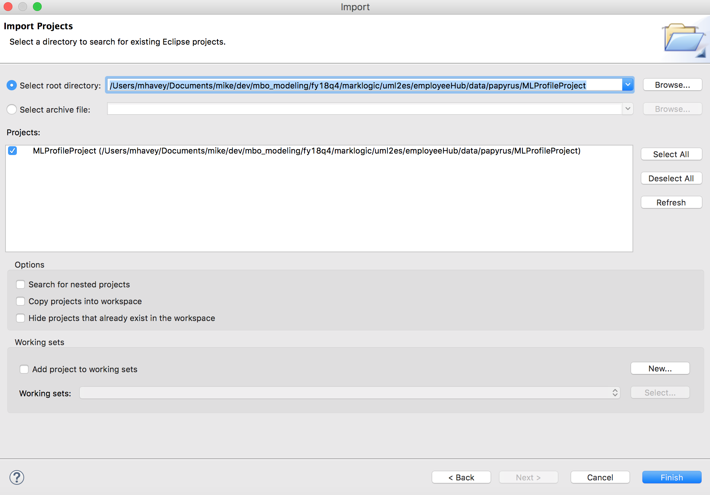
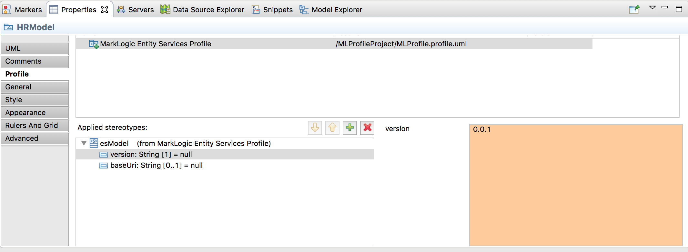
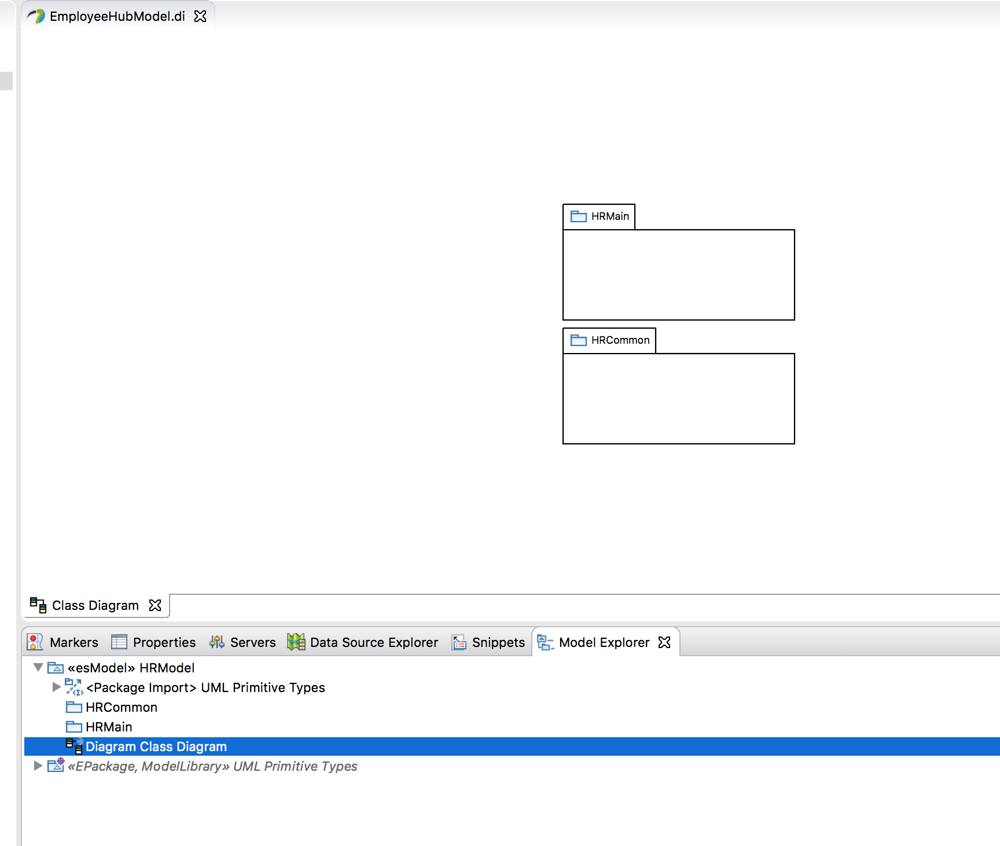

# Employee Cradle to Grave; Building an Employee Data Hub From Scatch. 

## Intro
Our [../examples](../examples) show the deployment and use of pre-cooked models. The [HR example](../examples/hr), for instance, demonstrates the use of an employee data model in MarkLogic's Data Hub framework. Being pre-cooked, the example showcases the finished product and does not walk through the soup-to-nuts process to create it.

In this tutorial, we cook an HR data hub from scratch. This tutorial is a recipe to build such a hub from basic ingredients: a UML modeling tool (Papyrus), MarkLogic database and its data hub framework, and this UML2ES toolkit. 

There is more than one cook in the kitchen. In a real-world project different people contribute in different roles. In our case, we need a data designer/architect to design the model, a source data subject-matter expert (SME) to tie the model to the raw source data set, a developer to bring the model and data into a servicable form in MarkLogic, and a build/admin person to provide a source code repo, a deployment process, and a runtime environment for the hub.

## Step 1: Standup a MarkLogic Environment and Source Code Repo (Build Person)

Click to view/hide this section

We get started by having you, in the role of build person, setup a basic data hub on MarkLogic. You will also create a source code repository with a folder structure in which different project artifacts are stored. 

There are two pre-requisites for running this step of the tutorial:

- You should have a MarkLogic 9.0-7 or greater installation up and running.
- You should have a local clone of the UML2ES toolkit. 

To begin, create a folder called employeeHub anywhere on your build machine. This folder will be a data hub gradle project that incorporates the UML2ES toolkit and has special sub-folders designated for the UML model, the source code mapping spreadsheet, and the source code. (All of these we will build, wearing a different hat, later in the tutorial.)

Under employeeHub, create the following subfolders:
- data
- src

Under employeeHub/data, create the following subfolders:
- mapping
- model
- papyrus

Under employeeHub/src, create the subfolder main.

Under employeeHub/src/main, creat the subfolder ml-modules.

Under employeeHub/src/main/ml-modules, create the subfolder root.

Copy into employeeHub/src/main/ml-modules/root the UML2ES transform code [../uml2esTransform/src/main/ml-modules/root/xmi2es](../uml2esTransform/src/main/ml-modules/root/xmi2es). You did it right if you can see the file employeeHub/src/main/ml-modules/root/xml2es/xml2esTransform.xqy. If you don't see the file in exactly that the location, remove what you copied and try again at the correct level. 

Copy into the main folder employeeHub the UML2ES build file [../uml2esTransform/uml2es4dhf.gradle](../uml2esTransform/uml2es4dhf.gradle).

Copy into employeeHub/data/papyrus the UML2ES profile [../umlProfile/eclipse/MLProfileProject](../umlProfile/eclipse/MLProfileProject). You did it right if you cn see the file employeeHub/data/papyrus/MLProfileProject/MLProfile.profile.uml. If you don't see the file in exactly that location, remove what you copied and try again at the correct level. 

Copy into the main folder employeeHub your initial build file [employeeHubLab/step1/build.gradle](employeeHubLab/step1/build.gradle) and your initial gradle properties file [employeeHubLab/step1/gradle.properties](employeeHubLab/step1/gradle.properties). Tweak the gradle.properties once you've copied it over. TODO ...

When you are done, you should have the following folder structure:

Now let's initialize the hub. In a command prompt navigate to your employeeHub folder and run the following:

gradle -i hubInit

This creates a few additional subfolders: plugins, src/main/hub-internal-config, src/main/ml-config, src/main/ml-schemas, build, gradle, and .gradle. 

If you wish, add the contents of the employeeHub folder to your source code repository. Don't add build, gradle, and .gradle; these folders contain temporary files that aren't meant to be shared.

Finally, let's create an instance of the data hub. In the command prompt, run the following

gradle -i mlDeploy

When this has completed, you should see in your MarkLogic environment several new databases, including xmi2es-tutorials-STAGING, xmi2es-tutorials-FINAL, and xmi2es-tutorials-MODULES. Check in admin console you have these.

## Step 2: Design UML Model for Employee Hub (Data Architect)

Click to view/hide this section

Next you get to play the role of data architect. You will use the UML modeling tool Papyrus to design a class model for employees. The file containing your model resides in the employeeHub folder the build person (performed convincingly by you) created in Step 1. 

### Step 2a: Setup Workspace and Projects

Pre-requisite: You need Papyrus. If you don't have Papyrus, install it. See [How to install Papyrus](papyrus_install.md) for instructions.

Open Papyrus in a new workspace. The location of the workspace on your local machine is unimportant. 

To use your new model with MarkLogic, you need to add the UML-to-Entity Service profile. In Step 1 you copied it from the UML2ES clone to employeeHub/data/papyrus/MLProfileProject. To import into Papyrus, from the File menu select Import | General | Existing Projects Into Workspace. 

Click Next. In the Import Projects dialog, make sure "Select root directory" is selected. Use the Browse button to locate the ML profile in employeeHub/data/papyrus/MLProfileProject. 

Click Finish. You should now see the profile project in the Project Explorer pane in the upper-right corner of Eclipse. Next, create a project for the employee model. From the File menu choose New | Other. From the Select wizard, choose Papyrus project.

Click Next. In the Diagram Language window, select UML.

Click Next. In the next window enter the project name as EmployeeHubModel. Select the model file name as EmployeeHubModel. For the location, uncheck "Use default location". For location, browse to the employeeHub/data/papyrus folder you created in Step 1.

Click Next.  In the next page, under Diagram Kind, select Class Diagram. Click the box "A UML model with basic primitive types." Under "Choose a profile to apply", select Browse Workspace and select MLProjectProfile|MLProfile.profile.uml. 

Click Finish. In Papyrus, you now see two projects in your workspace:

### Step 2b: Create Model and Package Structure

We will design a relatively simple model consisting of two main classes (Department, Employee) and a set of common location classes (Address, PhoneNumber, Email). We will split these classes into two packages: Department and Employee will go into the HRMain packages; the location classes will go in the HRCommon package.

Create the HRCommon package by dragging a Package from the Palette onto the diagram EmployeeodelHub.di. In the Properties pane edit the name of the package. Change it from Package1 to HRCommon. 

Create a second package in the same way. Name this one HRMain. 

Next, configure model-level attributes. In the diagram, click anywhere on the white background outside the packages you just created. In the Properties pane, in the UML section change the name from RootElement to HRModel.

Still in the Properties pane, move to the Profile section and scroll down to the Applied Stereotypes. Click on the + symbol. In the popup window, Under Applicable Stereotypes select esModel. 

 

Move them over to the Applied Stereotypes section by clicking the button with an arrow that points right. When done click OK to close the popup.

 

Back in the Properties pane, in the Applied Stereotyes part of the Profile section still, select version under esModel. Enter the value 0.0.1

 

Similarly for baseUri enter the value http://com.marklogic.es.uml.hr. Save the model (File | Save All).

We have now a properly named model with packages for its two main parts.

### Step 2c: Define HRCommon Classes

For the remainder of this step you will need the Model Explorer. If it is not open in your workspace, open it by selecting Window | Show View | Papyrus | Model Explorer. 

Model Explorer will now appear as a new pane, likely on the bottom or right part of the screen.

Using the Model Explorer, we will now create two new class diagrams, one for each package. Select the HRCommon package, right-click, and from the menu choose New Diagram | Class Diagram. 

Give it the name HRClassDiagram. Similarly for HRMain, create a class diagram called HRMainClassDiagram. Your model explorer should now show the following:

### Step 2 Summary

You created dadada... 

If you think you might have messed up along the way, a pre-cooked model is available under [employeeHubLab/step2/EmployeeHubModel](employeeHubLab/step2/EmployeeHubModel). TODO -- put it there; and talk about how to import it into the workspace ... ; or, at import time, get the model from here instead of from your shitty workspace...

