# Employee Cradle to Grave; Building an Employee Data Hub From Scatch. 

## Intro
Our [../examples](../examples) show the deployment and use of pre-cooked models. The [HR example](../examples/hr), for instance, demonstrates the use of an employee data model in MarkLogic's Data Hub framework. Being pre-cooked, the example showcases the finished product and does not walk through the soup-to-nuts process to create it.

In this tutorial, we cook an HR data hub from scratch. This tutorial is a recipe to build such a hub from basic ingredients: a UML modeling tool (Papyrus), MarkLogic database and its data hub framework, and this UML2ES toolkit. 

There is more than one cook in the kitchen. In a real-world project different people contribute in different roles. In our case, we need a data designer/architect to design the model, a source data subject-matter expert (SME) to tie the model to the raw source data set, a developer to bring the model and data into a servicable form in MarkLogic, and a build/admin person to provide a source code repo, a deployment process, and a runtime environment for the hub.

## Step 1: Standup a MarkLogic Environment and Source Code Repo (Build Person)

<details><summary>Click to view/hide this section</summary>
<p>
We get started by having you, in the role of build person, setup a basic data hub on MarkLogic. You will also create a source code repository with a folder structure in which different project artifacts are stored. 

There are two pre-requisites for running this step of the tutorial:

- You should have a MarkLogic 9.0-7 or greater installation up and running.
- You should have a local clone of the UML2ES toolkit. 

To begin, create a folder called employeeHub anywhere on your build machine. This folder will be a data hub gradle project that incorporates the UML2ES toolkit and has special sub-folders designated for the UML model, the source code mapping spreadsheet, and the source code. (All of these we will build, wearing a different hat, later in the tutorial.)

Under employeeHub, create the following subfolders:
- data
- src

Under employeeHub/data, create the following subfolders:
- mapping
- model
- papyrus

Under employeeHub/src, create the subfolder main.

Under employeeHub/src/main, creat the subfolder ml-modules.

Under employeeHub/src/main/ml-modules, create the subfolder root.

Copy into employeeHub/src/main/ml-modules/root the UML2ES transform code [../uml2esTransform/src/main/ml-modules/root/xmi2es](../uml2esTransform/src/main/ml-modules/root/xmi2es). You did it right if you can see the file employeeHub/src/main/ml-modules/root/xml2es/xml2esTransform.xqy. If you don't see the file in exactly that the location, remove what you copied and try again at the correct level. 

Copy into the main folder employeeHub the UML2ES build file [../uml2esTransform/uml2es4dhf.gradle](../uml2esTransform/uml2es4dhf.gradle).

Copy into employeeHub/data/papyrus the UML2ES profile [../umlProfile/eclipse/MLProfileProject](../umlProfile/eclipse/MLProfileProject). You did it right if you can see the file employeeHub/data/papyrus/MLProfileProject/MLProfile.profile.uml. If you don't see the file in exactly that location, remove what you copied and try again at the correct level. 

Copy into the main folder employeeHub your initial build file [employeeHubLab/step1/build.gradle](employeeHubLab/step1/build.gradle) and your initial gradle properties file [employeeHubLab/step1/gradle.properties](employeeHubLab/step1/gradle.properties). Tweak the gradle.properties once you've copied it over. For example, modify mlHost if you're ML server is not running on localhost; modify mlUsername and mlPassword if your admin username/password is not admin/admin.

When you are done, you should have the following folder structure:


Now let's initialize the hub. In a command prompt navigate to your employeeHub folder and run the following:

gradle -i hubInit

This creates a few additional subfolders: plugins, src/main/hub-internal-config, src/main/ml-config, src/main/ml-schemas, build, gradle, and .gradle. 

If you wish, add the contents of the employeeHub folder to your source code repository. Don't add build, gradle, and .gradle; these folders contain temporary files that aren't meant to be shared.

Finally, let's create an instance of the data hub. In the command prompt, run the following

gradle -i mlDeploy

When this has completed, you should see in your MarkLogic environment several new databases, including xmi2es-tutorials-empHub-STAGING, xmi2es-tutorials-empHub-FINAL, and xmi2es-tutorials-empHub-MODULES. Check in admin console you have these.


</p>
</details>

## Step 2: Design UML Model for Employee Hub (Data Architect)

<details><summary>Click to view/hide this section</summary>
<p>

Next you get to play the role of data architect. You will use the UML modeling tool Papyrus to design a class model for employees. The file containing your model resides in the employeeHub folder that the build person (performed convincingly by you) created in Step 1. 

### Step 2a: Setup Workspace and Projects

Pre-requisite: You need Papyrus. If you don't have Papyrus, install it. See [How to install Papyrus](papyrus_install.md) for instructions.

Open Papyrus in a new workspace. The location of the workspace on your local machine is unimportant. 

To use your new model with MarkLogic, you need to add the UML-to-Entity Service profile. In Step 1 you copied it from the UML2ES clone to employeeHub/data/papyrus/MLProfileProject. To import into Papyrus, from the File menu select Import | General | Existing Projects Into Workspace. 


Click Next. In the Import Projects dialog, make sure "Select root directory" is selected. Use the Browse button to locate the ML profile in employeeHub/data/papyrus/MLProfileProject. 


Click Finish. You should now see the profile project in the Project Explorer pane in the upper-right corner of Eclipse. Next, create a project for the employee model. From the File menu choose New | Other. From the Select wizard, choose Papyrus project.


Click Next. In the Diagram Language window, select UML.


Click Next. In the next window enter the project name as EmployeeHubModel. Select the model file name as EmployeeHubModel. For the location, uncheck "Use default location". For location, browse to the employeeHub/data/papyrus folder you created in Step 1. To this path append EmployeeHubModel.


Click Next.  In the next page, under Diagram Kind, select Class Diagram. Click the box "A UML model with basic primitive types." Under "Choose a profile to apply", select Browse Workspace and select MLProjectProfile|MLProfile.profile.uml. 


Click Finish. In Papyrus, you now see two projects in your workspace:


### Step 2b: Create Model and Package Structure

We will design a relatively simple model consisting of two main classes (Department, Employee) and a set of common location classes (Address, Phone, Email). We will split these classes into two packages: Department and Employee will go into the HRMain packages; the location classes will go in the HRCommon package.

Create the HRCommon package by dragging a Package from the Palette onto the diagram EmployeeodelHub.di. In the Properties pane edit the name of the package. Change it from Package1 to HRCommon. 


Create a second package in the same way. Name this one HRMain. 

Next, configure model-level attributes. In the diagram, click anywhere on the white background outside the packages you just created. In the Properties pane, in the UML section change the name from RootElement to HRModel.

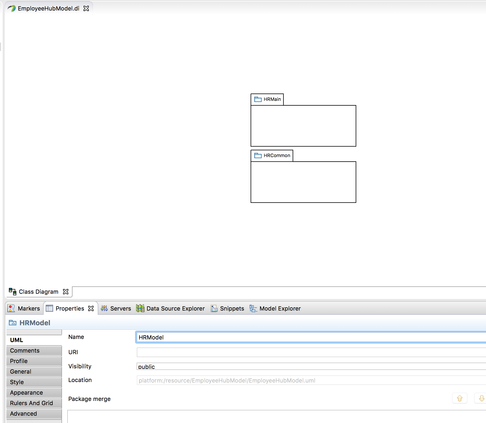

Still in the Properties pane, move to the Profile section and scroll down to the Applied Stereotypes. Click on the + symbol. In the popup window, under Applicable Stereotypes select esModel. 

 

Move it over to the Applied Stereotypes section by clicking the button with an arrow that points right. When done click OK to close the popup.

 

Back in the Properties pane, in the Applied Stereotyes part of the Profile section still, select version under esModel. Enter the value 0.0.1

 

Similarly for baseUri enter the value http://com.marklogic.es.uml.hr. Save the model (File | Save All).

We have now a properly named model with packages for its two main parts.

### Step 2c: Define HRCommon Classes

For the remainder of this step you will need the Model Explorer. If it is not open in your workspace, open it by selecting Window | Show View | Papyrus | Model Explorer. 


Model Explorer will now appear as a new pane, likely on the bottom or right part of the screen.


Using the Model Explorer, we will now create two new class diagrams, one for each package. Select the HRCommon package, right-click, and from the menu choose New Diagram | Class Diagram. 

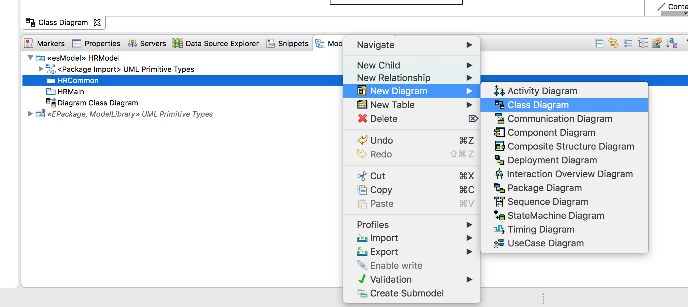

Give it the name HRClassDiagram. Similarly for HRMain, create a class diagram called HRMainClassDiagram. Your Model Explorer should now show the following:


Select the HRCommonClassDiagram in Model Explorer. Drag a Class from the Palette onto the HRCommonClassDiagram canvas. Name it Address. Similarly create classes Phone and Email. Your diagram should look like this:


Let's add attributes to each class. Select the Address class. From the context menu that appears, choose Add Property Class Attribute Label. 


Then in the UML section of the Properties pane, change its name from Attribute1 to addressType. Set the Type to UML Primitive Types | String. Keep the Multiplicity at 1.


At this point your diagram looks like this:


Add these attributes to Address:

- lines, type: string, multiplicity: 1..*
- city, type: string, multiplicity: 1
- state, type: string, multiplicity: 1
- zip, type: string, multiplicity: 1
- country, type: string, multiplicity: 1

Add these attributes to Phone:

- phoneType, type: string, multiplicity: 1
- phoneNumber, type: string, multiplicity: 1

Add these attributes to Email:

- emailType, type: string, multiplicity: 1
- emailAddress, type: string, multiplicity: 1

When you are done, your diagram should look like this:


### Step 2d: Define HRMain Classes

Now switch to the HRMainClassDiagram by double-clicking it in the Model Explorer. The canvas above is blank. Drag two classes onto it. Name them Employee and Department.


Add the following attributes to Employee:

- employeeId, type: string, multiplicity: 1
- firstName, type: string, multiplicity: 1
- lastName, type: string, multiplicity: 1
- status, type: string, multiplicity: 1
- hireDate, type: none, multiplicity: 1
- effectiveDate, type: none, multiplicity: 0..1
- baseSalary, type: real, multiplicity: 0..1
- bonus, type: real, multiplicity: 0..1
- dateOfBirth, type: none, multiplicity: 1
- uri, type: string, multiplicity: 1

Add the following attributes to Department:
 
- departmentId, type: integer, multiplicity: 1
- name, type: string, multiplicity: 1
- uri, type: string, multiplicity: 1

Here's what you should have so far:


Next we configure a few relationships. First, let's represent the memberOf relationship. An employee is a member of a department. To represent this, draw an association between the Employee class and the Department class. In the Palette select Association. Then with your mouse draw a line from Employee to Department. 

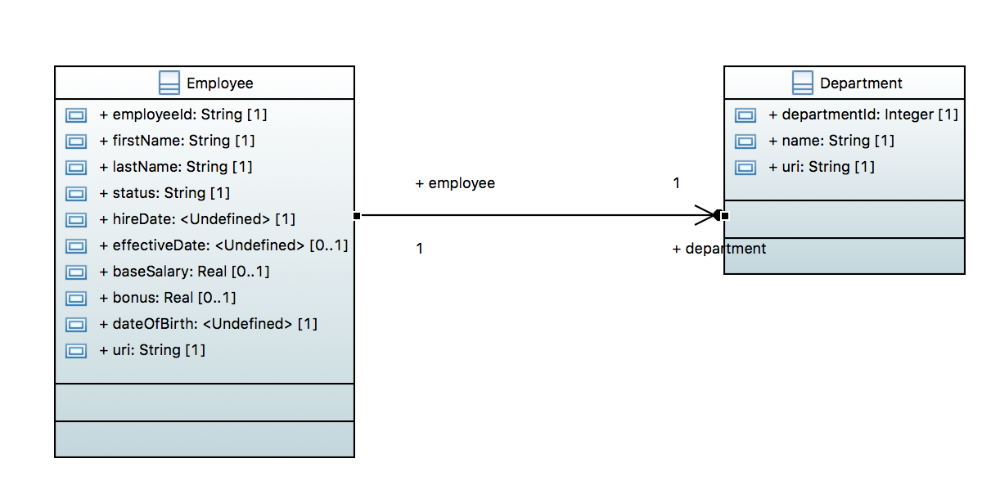

Select the association link you just drew and see the details of it in the Properties pane. You see two Member Ends. For the Member End on the right (labelled employee), ensure Navigable is set to false. For the Member End on the left, change the name from department to memberOf. Change the multiplicity to 0..1.

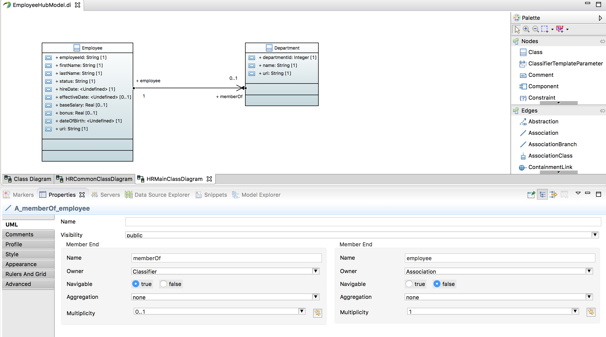

Next to do is the reportsTo relationship between employees. Draw an association from the Employee class to itself by selecting Association in the Palette and drawing a line from Employee back to itself. Then select that line you drew and in the Properties pane make sure the right Member End has Navigable set to false. For the left Member End, change the name to reportsTo and set multiplicity to 0..1.

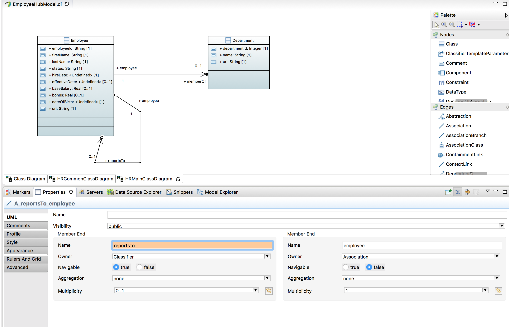

Now let's bring into this diagram the Address, Phone, and Email classes from our HRCommon package. In Model Explorer, under HRCommon select Address and drag it into the current diagram. Do the same with Phone and Email.

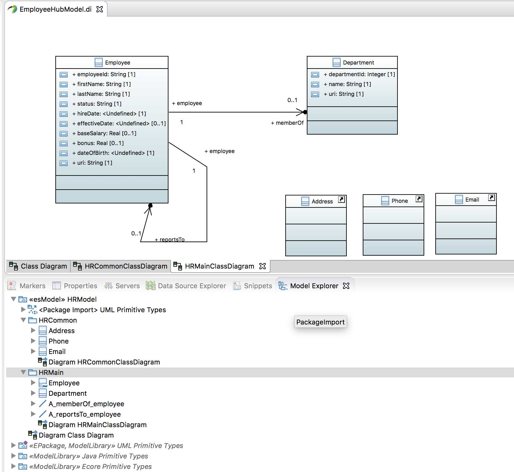

In our model, both Employee and Department have addresses, phones, and emails. We use aggregration relationships to represent this. Draw six association links: Employee to Address, Employee to Phone, Employee to Email, Department to Address, Department to Phone, and Department to Email. Because of all the arrows the diagram might be a bit messy. Let's make it pretty. First, move the classes into a good spot on the canvas:

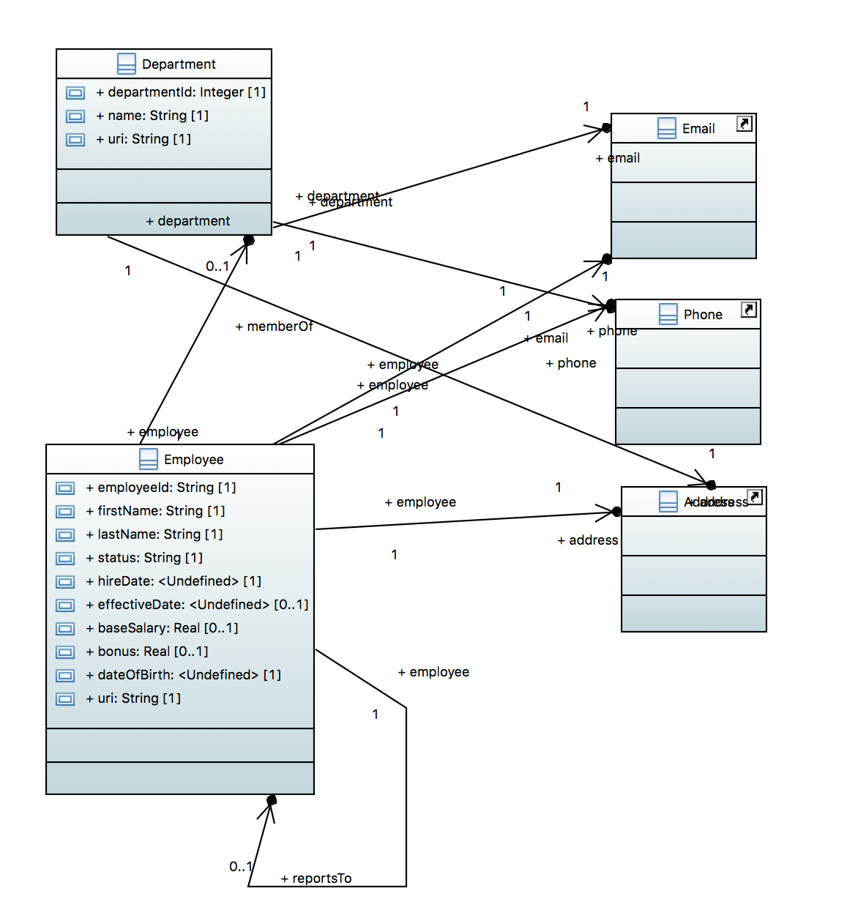

Next, remove unnecessary arrow labelling. Right-click on the white part of the diagram and from the context menu choose Select | All Connectors. Right-click again and choose Filters | Manage Connector Labels. In the popup, click Deselect All. Then manually select Target Role and Target Multiplicity under A_memberOf_employee and A_reportsTo_employee. 


Click OK to close the popup. Lastly, select Address, Phone, and Email. Right-click and select Filters | Show/Hide Compartments. In the popup click Deselect All. Click OK. We end up a more pleasant diagram:

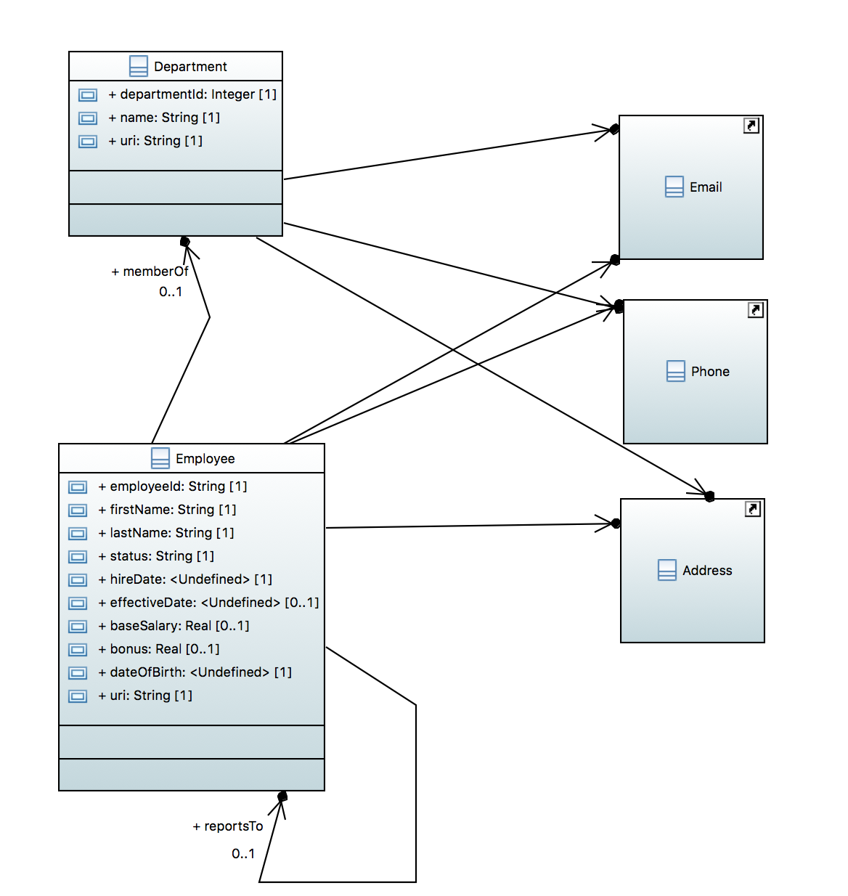

To complete the step, modify the configuration of each of the six associations to Address, Phone, and Email. For each, select the arrow in the diagram. In the Properties pane, ensure the right Member End is non-navigable. For the left Member End, change the multiplicity to 0..*, the aggregation to shared, and the name to the plural (addresses, phones, and emails rather than address, phone, and email). Here is what the configuration looks like for the link between department and email:


At this point, your model looks like this:


### Step 2e: Add Class and Attribute Stereotypes

Lastly, let's prepare the model for MarkLogic by stereotyping it. First, let's associate with the class Department the MarkLogic collection named "Department". To do this, select Department in the diagram. In the Properties pane, switch to the Profile section. In the Applied Stereotypes, click the + button. In the popup move xDocument from Applicable Stereotypes to Applied Stereotypes. 


Click OK. Then back in the Properties pane, add the value Department for the collections tag of xDocument.


Do the same for the Employee class. Assign it the stereotype xDocument with the collections value Employee.

Next, stereotype several of the attributes by first selecting the atttibute in the diagram and then stereotyping and tagging it in the Profile section of the Properties pane:

- Give Department.departmentId the stereotype PK.
- Give Employee.employeeId the stereotype PK.
- Give Employee.hireDate, Employee.effectiveDate, and Employee.dateOfBirth the stereotype esProperty with mlType "date".
- Give Department.uri the stereotype xCalculated. Its tagged value concat consists of three strings with the quotes included:
	* "/department/"
	* $attribute(departmentId)
	* ".json"


- Give Employee.uri the stereotype xCalculated. Its tagged value concat consists of three strings with the quotes included:
	* "/employee/"
	* $attribute(employeeId)
	* ".json"

Your last step is to configure the memberOf and reportsTo relationships to use reference rather than containment. In MarkLogic, you want Employee's memberOf attribute to contain the primary key of the Department rather than a copy of the Department object itself. You want Employee's reportsTo attribute to contain the primary key of the other Employee rather than a copy of the other Employee object itself. (The relationships from Department and Employee to Address, Phone, and Type, on the other hand, will be containment, not reference.)

To make the memberOf attribute referential, in the diagram, select the Employee class. In the Properties pane, go to the UML section. Under Owned Attribute, select memberOf. Double-click it. In the Edit Property popup, switch to the Profile tab. Click the + button. Move from Applicable Stereotypes to Applied Stereotypes the FK stereotype.


Do the same for reportsTo.

And here's the final diagram:


Save your work (File | Save All). If the build person has created a source code repository, push your model to that repo. Specifically, add the folders data/papyrus/MLProfileProject and data/papyrus/EmployeeHubModel to the repo.

### Step 2 Summary

You created a model with two packages: HRCommon, containing classes Address, Phone, and Email; and HRMain, containing classes Department and Employee. There are numerous relationships in your model, and your model includes several stereotypes. 

If you think you might have messed up along the way, a pre-cooked model is available under [employeeHubLab/step2/EmployeeHubModel](employeeHubLab/step2/EmployeeHubModel). If you want it in your workspace, the simplest way is to copy each of its files over yours. You can also delete the EmployeeHubModel project from your workspace (by right-clicking the project and selecting Delete, but keeping the contents!) and import the pre-cooked project (File | Import | Existing Projects Into Workspace). 

</p>
</details>

## Step 3: Confirm Model Works in MarkLogic (Build Person, Data Architect, Developer)

<details><summary>Click to view/hide this section</summary>
<p>
Next is a quick verification that the UML model can be deployed to MarkLogic as part of the build process. This gives the data architect the assurance that the model "works in ML." It gives the developer a first look at the model and how it is represented in ML. It gives the build person knowledge of the steps to deploy the UML model to ML.

We won't have any actual DHF code when this step completes. That comes later. But we will have proved that our UML model can be transformed to Entity Services. And with that assurance, we're off and running with ES-based development.

First, the build person modifies the build.gradle and gradle.properties files created in Step 1. Put on your build person hat and make the following edits:

- To build.gradle, add the following code at the end:

```
task prepHRModel(type: Copy) {
    from "data/papyrus/EmployeeHubModel/EmployeeHubModel.uml"
    into "data/model"
    rename '(.*).uml', '$1.xml'
}

task runUML2ESDeploy(type: GradleBuild) {
  buildFile = "uml2es4dhf.gradle"
  tasks = ["uDeployModel"]
}

task deployHRModel() {
  dependsOn "prepHRModel"
  dependsOn "runUML2ESDeploy"
  tasks.findByName('runUML2ESDeploy').mustRunAfter 'prepHRModel'
}
```

- To gradle.properties, add the following line at the end:

modelName=EmployeeHubModel

If you're not sure you did this correctly, look at pre-cooked files [employeeHubLab/step3/build.gradle](employeeHubLab/step3/build.gradle) and [employeeHubLab/step3/gradle.properties](employeeHubLab/step3/gradle.properties). 

To transform the UML model to Entity Services and deploy it to MarkLogic, you, still in the role of build person, run the following from the command line in the gradle project folder you created in Step 1.

gradle -i deployHRModel

That command should run successfully; you should see "BUILD SUCCESSFUL" when its completes. Now it's time for everyone, especially the data architect and the developer, to observe the effects of gradle deployment command just run. Playing these roles, open Query Console and navigate to the xmi2es-tutorials-empHub-FINAL database. Click on Explore. Among the documents created are the following:

- /marklogic.com/entity-services/models/EmployeeHubModel.json: This is the ES model corresponding to our UML model. Here is an excerpt. Notice that its structure is exactly as we defined it UML. This will reassure the data architect.


- /xmi2es/extension/EmployeeHubModel.ttl: There is more to the model than the JSON descriptor we just examined. You'll notice that the descriptor does not mention some of our stereotypes. Where, for example, is the xDocument and xCalculated configuration? The JSON descriptor is the *core* model, but in Entity Services there is also an *extended* model. The extended model expresses, using semantic triples, facts about the entities and attributes of the model that fall outside the core model. /xmi2es/extension/EmployeeHubModel.ttl is a Turtle representation of those facts. Open that document and peruse it. Alternatively, in Query Console open a tab of type SPARQL Query pointed to the xmi2es-tutorials-empHub-FINAL database. Run the following query:

select * where {?s ?o ?p}

Nearly 300 triples come back from this query, but most of them are out-of-the-box *core* triples. One of our extended triples indicates that the Employee entity's collection is "Employee":

	* <http://com.marklogic.es.uml.hr/HRModel-0.0.1/Employee> <http://marklogic.com/xmi2es/xes#collections> "Employee"

These triples show the calculated value of uri in the Department entity:

	* <http://com.marklogic.es.uml.hr/HRModel-0.0.1/Department/uri>,<http://marklogic.com/xmi2es/xes#calculation>,_:bnode7470cb4106d8a9b6
	* _:bnode7470cb4106d8a9b6,<http://www.w3.org/1999/02/22-rdf-syntax-ns#first>,"\"/department/\""
	* _:bnode7470cb4106d8a9b6,<http://www.w3.org/1999/02/22-rdf-syntax-ns#rest>,_:bnode7411cb4716d8c8b6
	* _:bnode7411cb4716d8c8b6,<http://www.w3.org/1999/02/22-rdf-syntax-ns#first>,"$attribute(departmentId)"
	* _:bnode7411cb4716d8c8b6,<http://www.w3.org/1999/02/22-rdf-syntax-ns#rest>,_:bnode7432cb4526d8ebb6
	* _:bnode7432cb4526d8ebb6,<http://www.w3.org/1999/02/22-rdf-syntax-ns#first>,"\".json\""
	* _:bnode7432cb4526d8ebb6,<http://www.w3.org/1999/02/22-rdf-syntax-ns#rest>,<http://www.w3.org/1999/02/22-rdf-syntax-ns#nil>

Those triples are not pretty, but both the data architect and developer will be happy to see that the stereotypes are accounted for in the MarkLogic model. These extended facts will be used in the DHF harmonization logic. Significantly, the UML2ES toolkit generates useful (and relatively pretty) harmonization code from the extended model. 

- /xmi2es/gen/EmployeeHubModel/lib.sjs: And here is the first bit of that generated code. Notice the following generated Javascript functions. runWriter_Employee creates an Employee JSON document and, according to the extended model, writes it to the "Employee" collection. doCalculation_Employee_uri constructs the uri attribute of Employee as the string concatenation of "/employee/", the employeeId attribute value, and ".json". We'll see in a later step how these functions are brought together in the harmonization.

```
function runWriter_Employee(id, envelope, ioptions) {
  var uri = id;
  var dioptions = {};
  var collections = [];
  collections.push("Employee");
  dioptions.collections = collections;
  dioptions.permissions = xdmp.defaultPermissions();
  xdmp.documentInsert(uri, envelope, dioptions);
}
function doCalculation_Employee_uri(id, content, ioptions) {
  var c = "";
  c += "/employee/";
  c += content.employeeId;
  c += ".json";
  content.uri = c;
}
```

- /xmi2es/findings/EmployeeHubModel.xml: This file records problems found during transformation. Stop and open this up. Check to make sure it reports no issues.

The step is nearly complete. If you are keeping the gradle project in a source code repo, add the following newly created files to the repo: 
- data/entity-services/EmployeeHubMode.json
- src/main/ml-modules/root/modelgen/EmployeeHubModel/*

Also push your changes to build.gradle and gradle.properties.

</p>
</details>

## Step 4: Define Mapping Spec (Source Data SME)

<details><summary>Click to view/hide this section</summary>
<p>
The goal of the employee hub is to represent employees and departments in the form expressed by the UML model. That's the FINAL form of the data. But the actual employee data we have from the company's source system is messy. We intend to ingest this data *as is* into STAGING and then *harmonize* that data into the FINAL form. Data Hub Framework is exactly the right tool for the job. Now all we need is to understand that messy source data.

Luckily one of the members of the team is a source data SME. In this step, you play the SME's role. Your deliverable is an Excel spreadsheet that describes how to map source data to the UML model. 

Let's first review what that data looks like. It's a set of CSV and JSON files. We used the same data in the [HR example](../examples/hr). You can see it in the [../examples/hr/data/hr](../examples/hr/data/hr) folder of your local clone of the UML2ES toolkit. Our company, GlobalCorp, recently acquired AcmeTech. Each company has its own employee data: [../examples/hr/data/hr/GlobalCorp](../examples/hr/data/hr/GlobalCorp) and [../examples/hr/data/hr/AcmeTech](../examples/hr/data/hr/AcmeTech).

GlobalCorp has three files:

- [../examples/hr/data/hr/GlobalCorp/employee/EmployeeTable.csv](../examples/hr/data/hr/GlobalCorp/employee/EmployeeTable.csv). This is a CSV extract from the source relational database with the main employee record. Here is the first row and its header:

```
emp_id,first_name,last_name,dob,addr1,addr2,city,latitude,longitude,state,zip,home_phone,mobile,pager,home_email,job_title,hire_date,work_phone,work_email,reports_to,dept_num,office_number
356,Tina,Webb,2/20/1988,62 Mayer Plaza,,El Paso,31.6948,-106.3,TX,88535,1-(915)584-8677,1-(339)592-9887,,,Marketing Manager,9/21/2007,1-(402)348-8753,Tina.Webb@foo.com,4,3,218
```

- [../examples/hr/data/hr/GlobalCorp/employee/SalaryTable.csv](../examples/hr/data/hr/GlobalCorp/employee/SalaryTable.csv). This is a CSV extract from the source relational database with the employee's salary details. Here is the first row and its header:

```
emp_id,status,job_effective_date,base_salary,bonus
1,Active - Regular Exempt (Part-time),07/07/2013,59783,8787
```
- [../examples/hr/data/hr/GlobalCorp/department/DeptTable.csv](../examples/hr/data/hr/GlobalCorp/department/DeptTable.csv). This is a CSV extract from the source relational database with the department record:

```
dept_num,dept_name
1,Sales
```
AcmeTech's data is simpler. Each employee has a JSON file. For example the file for Rosanne Henckle is [../examples/hr/data/hr/AcmeTech/32930.json](../examples/hr/data/hr/AcmeTech/32930.json):

```
{
  "id": "32920",
  "firstName": "Rosanne",
  "lastName": "Henckle",
  "dateOfBirth": "05/19/1979",
  "hireDate": "12/19/2005",
  "salaryHistory": [
    {
      "effectiveDate": "12/23/2005",
      "salary": 63439
    },
    {
      "effectiveDate": "01/14/2010",
      "salary": 66300
    }
  ]
}
```

As the source data SME, you realize that your deliverable is actually two mapping spreadsheets: one for GlobalCorb, another for AcmeTech. The UML2ES toolkit has a template: [../excel/uml2es-excel-mapping-template.xlsx](../excel/uml2es-excel-mapping-template.xlsx). Make two copies of it and store both in the data/mapping folder of the gradle project created in Step 1. Name them acme-mapping.xlsx and global-mapping.xlsx. 

Open up acme-mapping.xlsx. Notice it has three tabs: Instructions, Mapping, and Entity1. Leave Instructions as is; read it over and keep it in place. Edit Mapping with overall details about the AcmeTech data source. 

- For Mapping Source, enter "ACMETech HR Data" (cell B1)
- For Mapping Notes, enter "JSON Employee Files From Acquired Firm ACME" (cell B2)

When you are done, the Mapping tab should look like this:

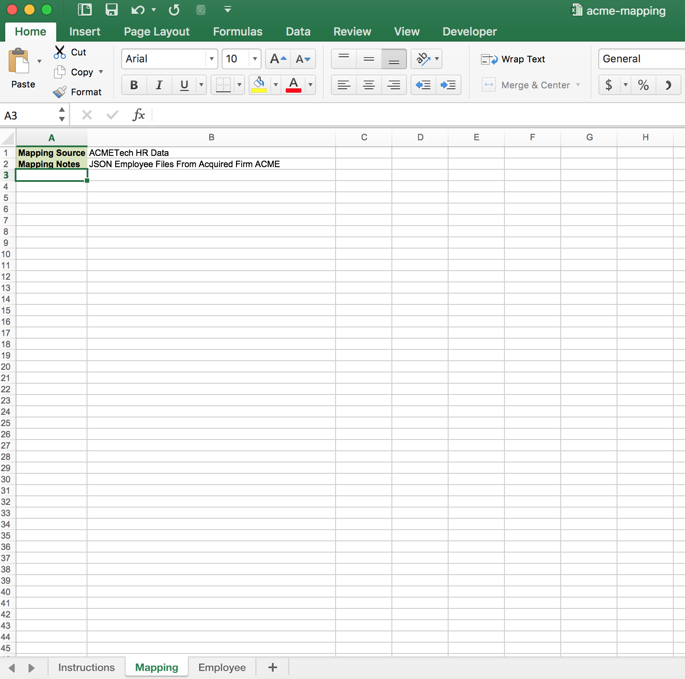

As for Entity1, you should make several copies of it, one for each entity that will be represented in the hub. *Entity* is not synonymous with *class*. Our model has five classes -- Employee, Department, Address, Phone, Email -- but really just two entities: Employee and Department. In the FINAL hub, Employee and Department instances are first-class documents, each stored in an envelope and referenced by a URI. Address, Phone, and Email are mere sub-documents of Employee and Department. They exist only as part of the structure of those entities. In the mapping sheet, you specify how to map source data to the fully-expanded structure (including sub-classes) of the entity.

AcmeTech has no department data, only employee data. So the Acme sheet only requires a tab for Employee. Rename the Entity1 tab to Employee. Enter the following entity-level details:

- Entity Name: enter "Employee" (cell B1)
- Mapping Source: enter "Employee JSON document" (cell B2)
- Mapping Notes: enter "Each employee has JSON file xyz.json, where xyz is the numeric employee ID." (cell B3)
- Ignore rows 4-6, which are for the optional data discovery feature not discussed in this tutorial.

Specify the mappings of each attribute in the Properties section of the Employee sheet. Add a row for each attribute to map, starting on row 13. In column A put the attribute name from the model. In column B specify how to map source data to that attribute's value. In column C enter an optional note about this mapping. Ignore Columns D and E, which are for the optional data discovery feature not discussed in this tutorial. 

AcmeTech's data doesn't cover the full detail of Employee. Enter rows for the following attributes. The Column A values are the following. See if you can complete Columns B and C based on your understanding of the mapping. You don't need to be precise. The spreadsheet is not executable code. It is intended as a useful documentation artifact to help the developer harmonize the data.

- employeeId
- firstName
- lastName
- dateOrBirth
- effectiveDate
- status
- hireDate

You should end up with an Employee sheet resembling the following:


Save acme-mapping.xlsx. Now it's time for global-mapping.xlsx. Open it. Edit the Mapping tab as shown:

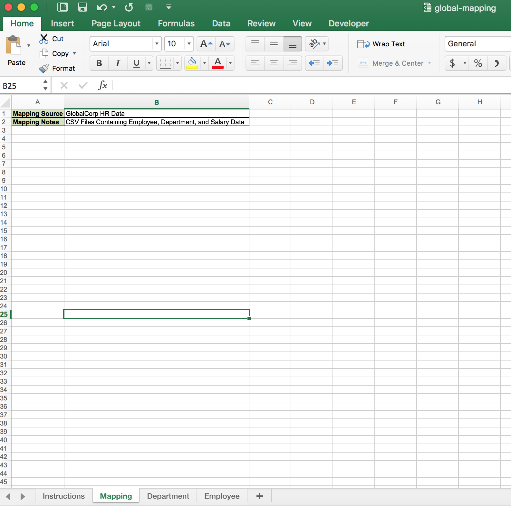

We need two entity tabs, one for Employee, one for Department. Make a copy of Entity1. Name the two entity tables Employee and Department. The previous diagram shows the correct tab structure.

Edit the Department tab. This mapping is simple. It should look like this:

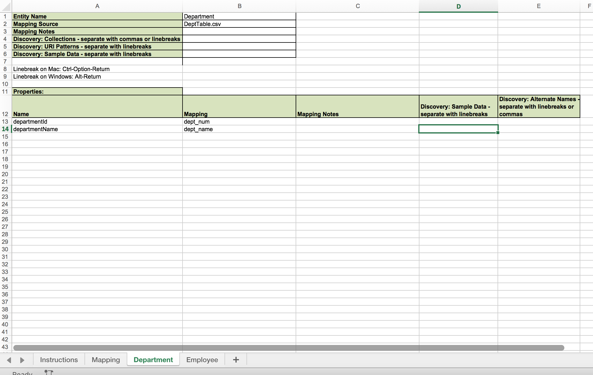

The Employee tab is more complicated, because we have inline attributes like addresses.lines. We also have to join EmployeeTable and SalaryTable. It should look like this:


If you messed up with the spreadsheets, good pre-cookied copies are available at [employeeHubLab/step4](employeeHubLab/step4). Copy the two xlsx files there over to the data/mapping folder in your gradle project.

Finally, if you have your code in a source code repo, add two new files -- data/mapping/acme-mapping.xlsx and data/mapping/global-mapping.xlsx -- to the repo. 

</p>
</details>

## Step 5: Ingest and Harmonize Employee Hub (Developer with Assist from Build Person)

<details><summary>Click to view/hide this section</summary>
<p>


Finally, add/push changes to the source code repo... And here are the contents that should be in that repot...

</p>
</details>
