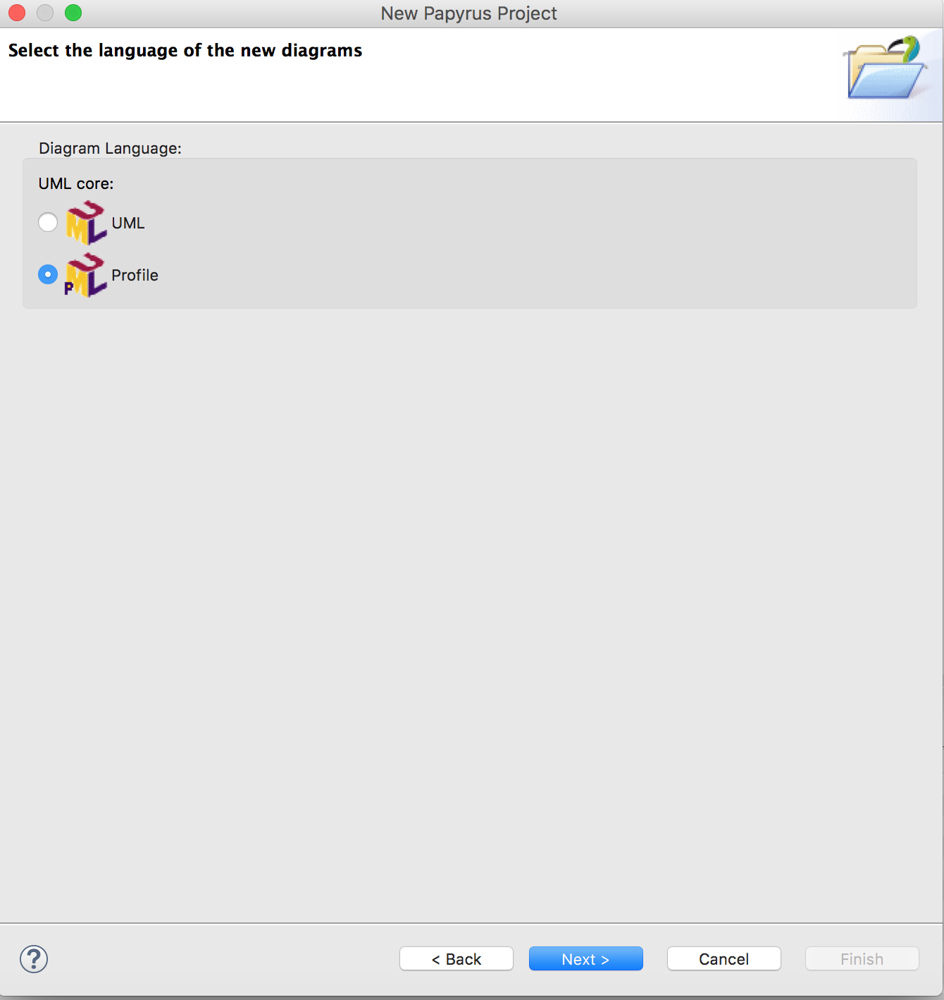
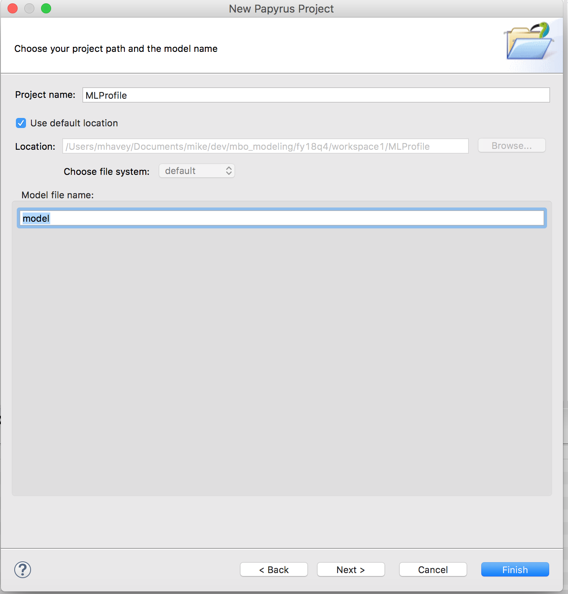
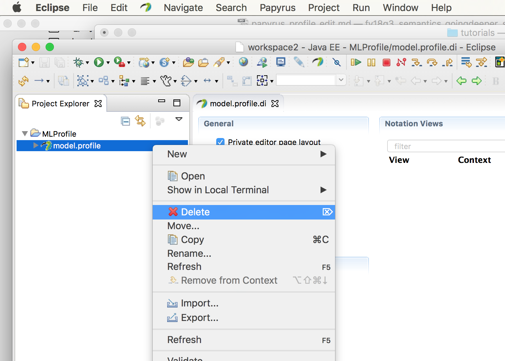
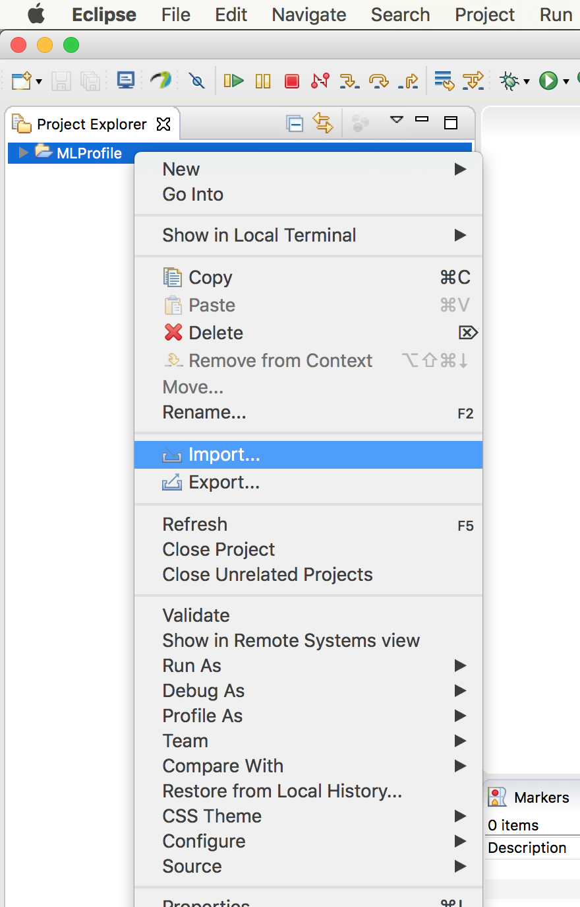
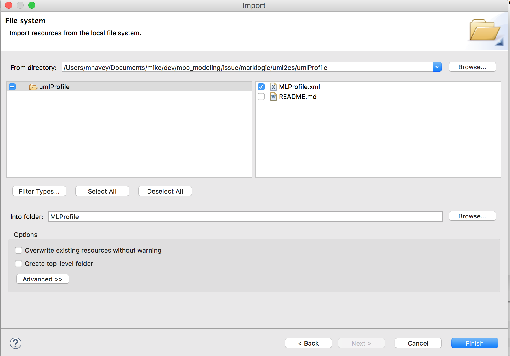
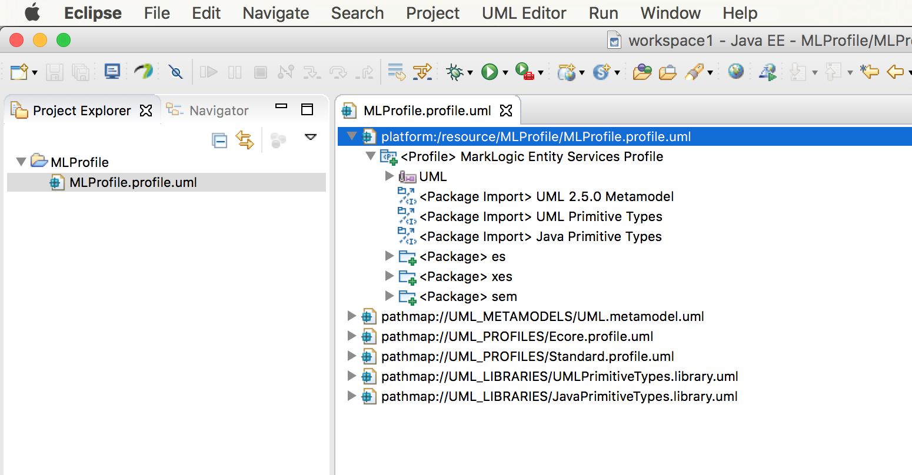
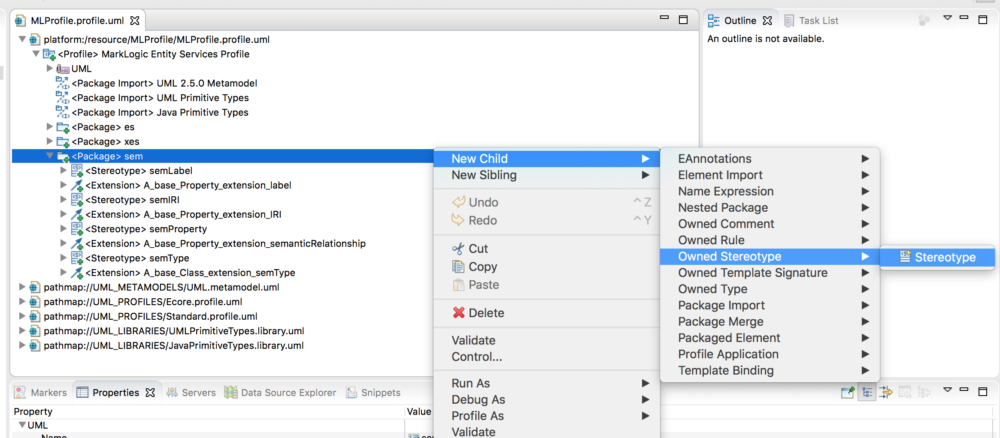
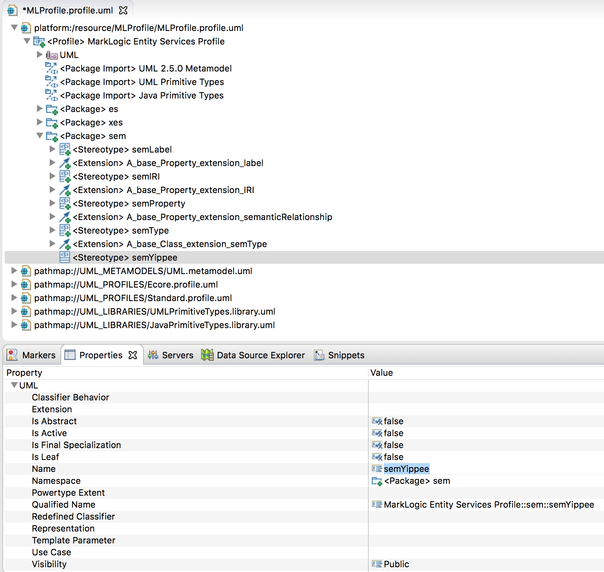
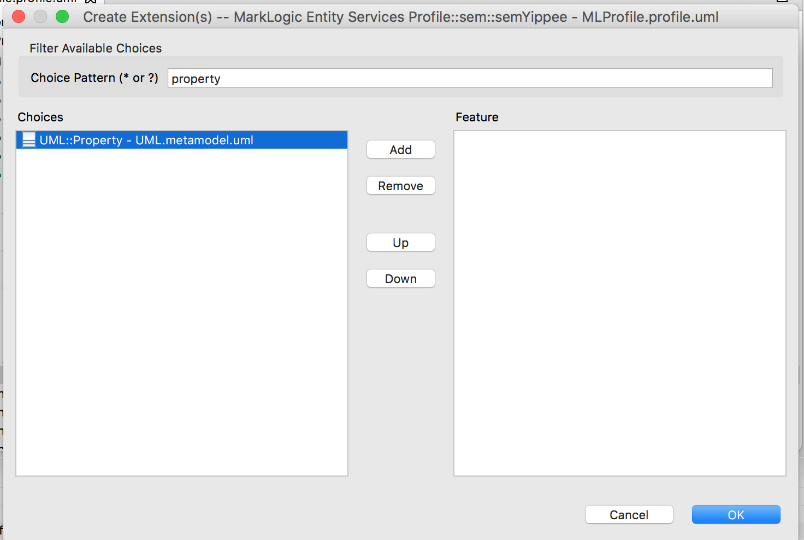
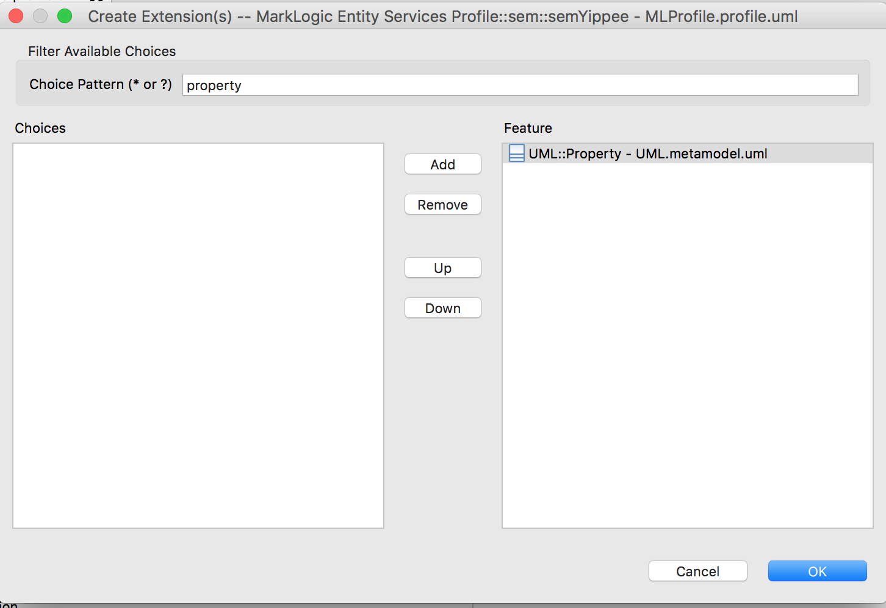

# How To Edit the UML-to-Entity Services Profile in Papyrus

## Intro
In the UML-To-Entity Services toolkit, we use MagicDraw, not Papyrus, to design the UML profile for MarkLogic. Both of these tools have excellent profile modelling capabilities, but we have gone with MagicDraw. 

It is nonetheless possible to edit the profile in Papyrus. There are two ways to do this, but only one of these is feasible in the current version of the toolkit.

The first way is to use Eclipse Modeling Framework (EMF) UML editor. This editor is bundled with Papyrus, so if you installed Papyrus into your Eclipse, you already have the EMF UML editor. The EMF UML editor, frankly, is intended for technical users. It doesn't offer the intuitive drag-onto-canvas method of MagicDraw. Still, with some guidance this first way is a workable approach. This tutorial will guide you through it. 

The second way is to use the full Papyrus profile diagram editor to graphically build the profile. This tool is as user-friendly as MagicDraw for building new profiles, but cumbersome for editing a profile that was designed in another tool. For toolkit development, we'll use this approach only if we decide to switch from MagicDraw to Papyrus to maintain the profile. We might make that switch some day, but for now our profile tool is MagicDraw. We won't attempt the second way.

## How to edit the profile:

### Create project in Eclipse.

Open Eclipse. Create a project for the profile by choosing File | New | Project. In the New Project window, select Papyrus Project.

Click Next. In the New Papyrus Project window, select Profile:

In the New Papyrus Project window name your project MLProfile.

Click Finish. You now see your new project. From Project Explorer, delete the dummy profile that was created. Right-click on model.profile and select Delete.

Import into the project the MLProfile.xml file that is in your local clone of the toolkit. The location is uml2es/umlProfile/MLProfile.xml. Do NOT use the MagicDraw file at uml2es/umlProfile/magicdraw/MLProfile.xml. To import, in Project Explorer right-click on the project name (MLProfile). From the context menu, select Import.

From the Import window, choose General | File System.

Click Next. In the next window, in the text box "From directory", enter the full path of the directory that contains the profile. Then in the right panel, select MLProfile.xml. 

Click Finish.

Rename the file to MLProfile.profile.uml by right-clicking on the file and selecting Rename.

### Editing the profile

Double-click on the file MLProfile.profile.uml to open it in the EMF UML editor. If you expand it a few levels, you see that is is divided into three subpackages: es, sem, xes.

Let's add a new stereotype to the sem subpackage. Right-click the sem package, and select New Child | Owned Stereotype | Stereotype. 

In the properties panel, type the name. We will call it semYippee.

You should decide whether the stereotype applies to UML packages, classes, properties, or some combination of these. Let's configure semYippee to apply to properties. Select the stereotype and from the main Eclipse menu select UML Editor | Stereotype | Create Extension.

In the Create Extensions window, under Choice Pattern enter "property". Then under Choices select UML::Property and click Add to move it to the right side.

When done click OK.

### Saving the profile

When you are done editing, save the profile by selecting File | Save All from the menu. You can use this modified profile in your Papyrus models.

